# SoftLayerハンズオン サーバー管理 Windows Server編


## 事前準備

- SoftLayerのアカウントは、事前取得していることを前提にしています。次の「SoftLayer 無料トライアルのご案内」を参照してください。
> 【SoftLayer無料トライアルのご案内<br>】http://www.ibm.com/cloud-computing/jp/ja/softlayer_flow.html

- 当日は取得したアカウントを使用してハンズオンを行います。数十円程度の課金が発生します。
- SoftLayerのアカウントの解約について
全てのリソースがアカウントから削除されますと、お客様のアカウント環境はクローズされ、お手持ちのIDとパスワードでのログインが出来なくなり、事実上ご解約の扱いとなります。ただし、もし同じアカウントIDで再度アカウントを開通されたい場合にはSoftLayerの公式WEBサイト等のチャットにてお申し出頂く事で再度開通させて頂く事も可能です。
課金をされない状態でSoftLayerのアカウントは残しておきたいい場合は、Object Storageのアカウントを作成しておく事をお勧めします。
-	使用するブラウザは、Chromeか、Firefoxをお勧めします。Internet Explorerをお使いの場合、表示されなかったり、表示が崩れたりする事があります。
- 一部、管理ポータルとWebのドキュメント間で用語の不一致がありますが、管理ポータルの大幅な改良や、サービスカテゴリの見直しなどの過渡期にあるためです。


## 管理ポータルへのログイン

SoftLayerの利用は、管理ポータルから操作します。

- https://control.softlayer.com/ にアクセスして、ログインしてください。
  
> - 最初にログオンされた方は、パスワードの変更を促されますので、変更してください。<br>
>- 同じネットワークからのログイン要求で、パスワードを連続3回間違えると、そのネットワークからのログイン要求を30分間遮断しますので、パスワードは慎重にいれてください。<br>
>- ブラウザは、Chrome、Firefoxをお勧めします。Internet Exploreは表示されない場合があります

## 3 仮想サーバーの利用
SoftLayer上では、WindowsやLinux、FreeBSD等様々なサーバOSが動くインスタンスをデプロイして利用することができます。本ハンズオンではWindows Server 2012を利用します。
### 仮想サーバのデプロイ
> 注意 : この作業は課金されます。無料トライアルアカウントユーザの場合、ご注意ください。
無料トライアルでアカウントを取得すると、仮想サーバが既に作成され起動しています。
この最初に作成された仮想サーバは無料で1ヶ月間利用することができます。
今回のハンズオンは、2台目の仮想サーバを作成しハンズオンを行います。
仮想サーバ1台につき、約$0.12/ hour課金されます。
※2014年6月20日現在

#### Order Device
管理ポータルから[Devices]→[Device List]を選んでください。さらに、次の画面から[Order Devices]をクリックしてください。


製品とサービスのオーダー画面が表示されますので、[Public Cloud Instances]で、[Hourly]をクリックしてください。

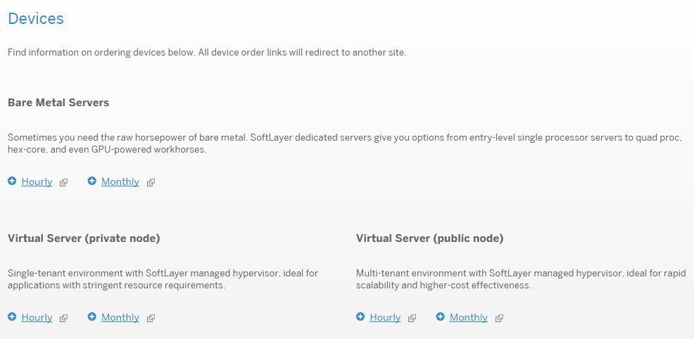

オーダー時に指定するデプロイ先のデータセンターは講師の指示に従ってください。

オーダー画面のOperating Systemをクリックし、Microsoftと書かれたリンクをクリックすることで、SoftLayer上で利用可能なWindows Serverのエディション一覧を確認することが出来ます。OSのバージョンはWindows Server 2003からWindows Server 2012が、各バージョン内でStandard,Datacenterといった様々なエディションが利用可能です。

本ハンズオンでは二台のWindows Server 2012のStandard Editionを利用します。以下の構成で二台注文してください。

|項目名                      |パラメータ                                                                               |
|:--------------------------:|:---------------------------------------------------------------------------------------:|
|Data Center                 |San Jose 1                                                                               |
|Operating System            |Windows Server 2012 Standard Edition(64 bit)                                             |
|First Disk                  |100 GB (SAN)                                                                             |
|Advanced Monitoring         |None                                                                                     |
|Hardware & Software Firewall|None                                                                                     |
|Monitoring                  |Host Ping                                                                                |
|Response                    |Automated Notification                                                                   |
|Provisioning Scripts        |指定なし                                                                                 |
|Host Name                   |ご自身のアカウントを利用している方: 任意<br>IBM から貸与したアカウントを利用している方: アカウント名|
|Domain Name                 |ご自身のアカウントを利用している方: 任意<br>IBM から貸与したアカウントを利用している方: handson.jp  |


# Windows Server環境の構築
## Windows Serverへのログイン

SoftLayerのWindows Serverインスタンスは、デプロイ直後からリモートデスクトップサービスが有効になっています。Webポータルからパスワードを確認し、リモートデスクトップサービスを用いてログインします。Device - Device Listを開き、一台目のWindows Serverの左側にある三角をクリックし、パスワードを確認します。

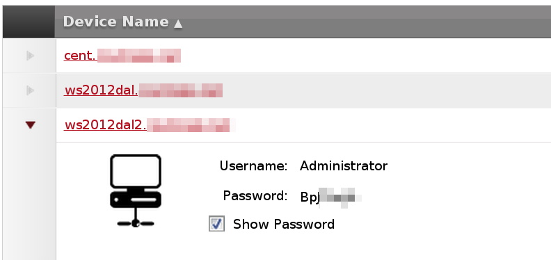

パスワードを確認したら、リモートデスクトップ接続します。Windowsのプログラム一覧からリモートデスクトップを選択して起動してください。

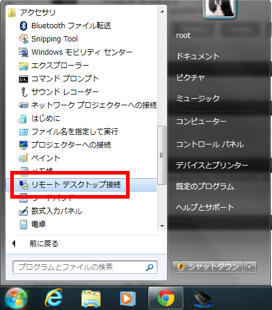


ユーザー名とパスワードの入力を求められたら、上で確認したとおりに、ユーザー名にAdministrator、パスワードにポータルで確認した文字列を入力してください。

証明書に関する警告が出た場合は、同意して接続を続行してください。

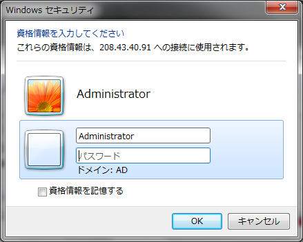

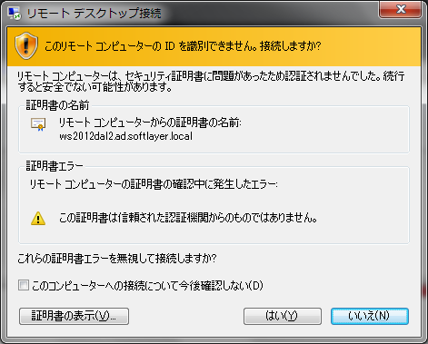

無事認証されたら、SoftLayer上にデプロイされているWindows Serverのデスクトップ画面が表示されます。

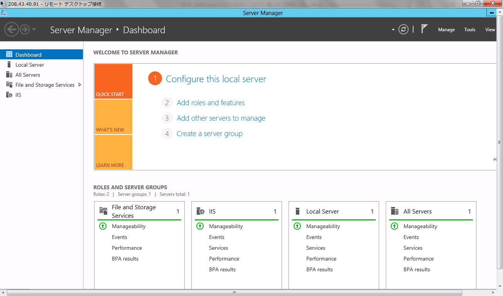

## Internet Information Services(IIS)のインストールと設定
Windows ServerにはInternet Information Services(IIS)という名前のWebサーバが含まれています。SoftLayer上でWindows Serverのインスタンスをデプロイしたら自動で有効化されるので、利用に際して追加で作業を行う必要はありません。

ご自分のパソコンでブラウザを開き、Windows ServerインスタンスのPublic IPアドレスを入力してください。IISのテストページが表示されます。

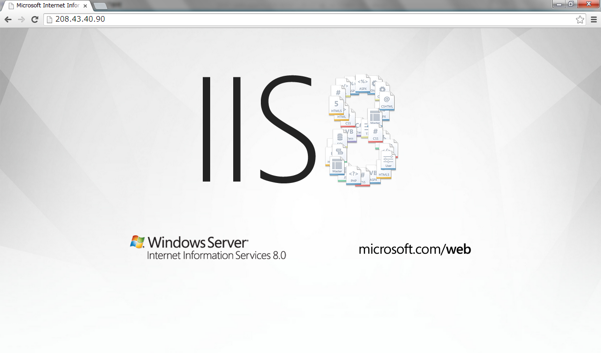

IISで提供されているWebページに、自分でファイルを追加して表示してみましょう。下のフォルダアイコンをクリックしてExplorerを起動し、左のComputerをクリックしてください。

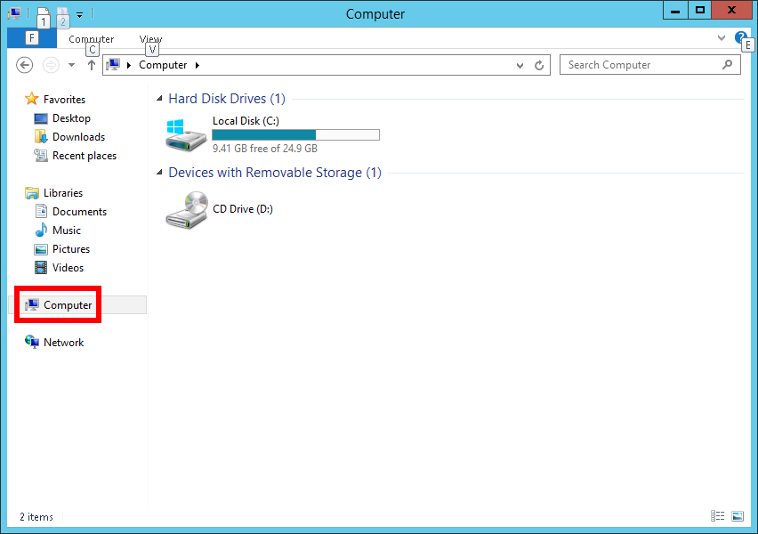

IISのWebサイトはC:\inetpub\wwwroot以下に存在します。当該フォルダを開くと、iisstartという名前のファイルが存在しています。このファイルをダブルクリックすると、最初にブラウザでWindows ServerのインスタンスのPublic IPアドレスを指定して開いた際と同じ内容が表示されます。

このフォルダにファイルを置いて、インターネット越しに閲覧できることを確認します。


最初に、ファイルの拡張子を表示するように背低を変更します。Explorerの右上、クエスチョンマークのすぐ左のアイコンをクリックし、表示されたリボンメニューの一番右のOptionsをクリックします。


表示されたオプションメニューのViewタブを開き、「Hide Extensions for known file type」に入っているチェックをはずすと、ファイルの拡張子が表示されるようになります。


拡張子を表示するように変更したら、IISのコンテンツが格納されているフォルダ上で右クリックして、New→Text Documentから新しいテキストファイルを作成します。ファイル名はsoftlayer.txtとします。


作成したsoftlayer.txtを開き、中に以下の内容を書き込みます。

```
<html>
  <body>
    SoftLayer
  </body>
</html>
```

書き込んで内容を保存したら、ファイル名をsoftlayer.txtからsoftlayer.htmに変更し、以下のURLにアクセスしましょう。

```
http://Windows Serverの Public IPアドレス/softlayer.htm
```

以上でIISの紹介は終了です。

## ファイルサーバのインストールと設定
IISと同じく、SoftLayer上にWindows Serverをデプロイした時点で、ファイルサーバ機能が有効になっています。SoftLayer上のWindows Serverで共有フォルダを作成し、アクセスを行ってみましょう。

最初に、Cドライブ直下にsharedディレクトリを作成します。ディレクトリを作成したら、右クリックしてPropertiesを開きます。

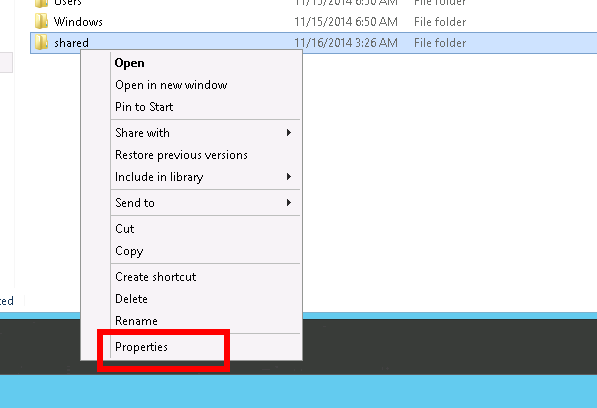

プロパティを開いたら、上段Sharingタブ内のShareボタンを押すことでフォルダの共有に関するウィザードが始まります。

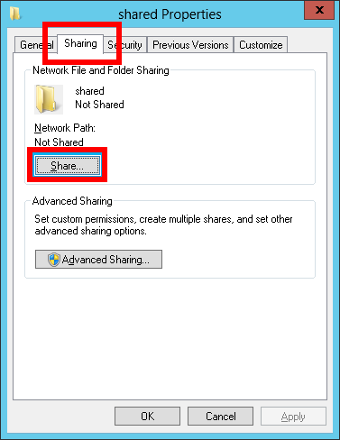

ウィザード内では、フォルダを誰に向けて共有するかの設定を行います。ここではEveryoneを指定して、下のShareをクリックしてウィザードを進めてください。

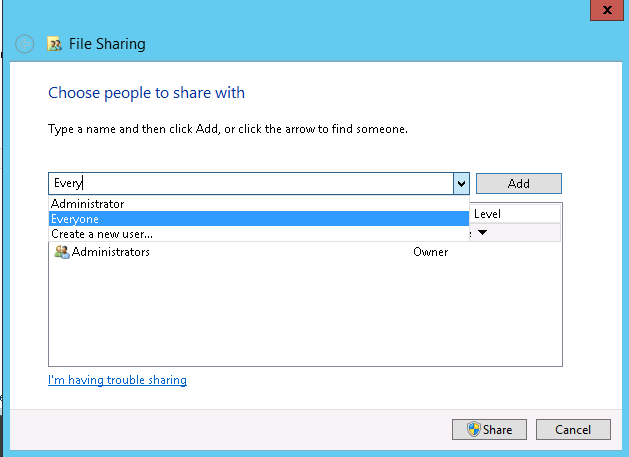

これで共有の設定は完了となります。実際にアクセスしてみましょう。


手元のパソコンでWindowsキーを押しながらRを押して、「ファイル名を指定して実行」のメニューを出し、\\インスタンスのPublic IPアドレス と入力し、実行してください。

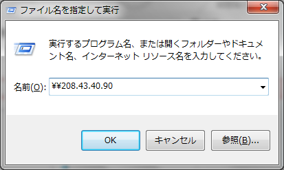

以下のようにパスワード認証画面が表示された場合は、リモートデスクトップのときと同様にSoftLayerの管理ポータルからAdministratorのパスワードを確認し、ユーザー名にAdministrator,パスワードに管理ポータル上に表示されているパスワードを塚手接続してください。

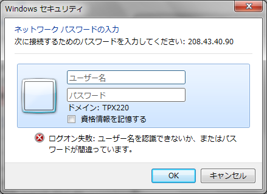

無事接続して、作成したsharedディレクトリが存在していることが確認できました。試しにshared内にファイルやディレクトリを作成してみましょう。


## Active Directory環境の構築
Active Directoryはその名のとおりWindows環境向けのディレクトリサービスです。ディレクトリサービスとは、ユーザ情報や権限、ストレージやプリンタといったリソースを複数のマシンで分散して管理するのではなく、サーバ上で集中管理する仕組みです。ディレクトリサービスを利用することで、個々のクライアントでは設定を行わずにディレクトリサービスを提供しているサーバの情報を参照することでユーザ情報やリソースを利用することが可能となり、大規模環境における管理コストを大幅に低減できます。

本ハンズオンでは、Active Directoryの最も簡単な使い方として、ユーザ情報をサーバ側で追加することで、クライアント側ではユーザ情報を追加していない場合でも利用可能となる環境を構築します。

### Active Directoryのインストール
Active Directoryのインストールはサーバマネージャ経由で行います。まず下のバーの一番左のアイコンをクリックし、サーバマネージャを起動してください。

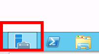

サーバマネージャが起動したら、画面中央のAdd roles and featuresをクリックします。

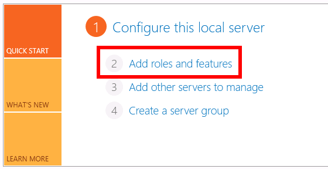

Before you beginと題した内容が表示されますが、一通り目を通した後Nextを謳歌してください。

次のSelect installation typeでは、Active Directoryのロールを追加するので、上のRole-based or feature-based installationを選択します。

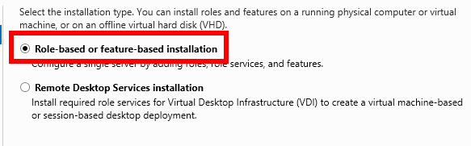

次のSelect destination serverでは、Select a server from the server poolを選択します。本ハンズオンでActive Directosyサーバにするサーバは1台のみなので、下のServer Poolに表示されるサーバも一台のみとなります。

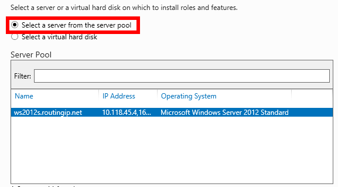

続いてSelect server rolesで複数のロールが提示されていますが、今回はActive Directoryのドメインコントローラ機能のみを追加します。以下に示すとおり、Active Directory Domain Servicesにチェックを入れてNextを押します。

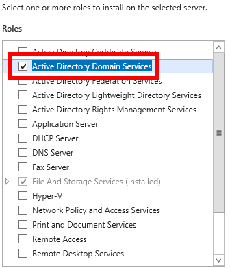

Select featuresでは特に機能を追加する必要はありません。そのままNextをクリックして進んでください。最後にConfirm Installation Selectionでインストールする機能の一覧が表示されます。確認のうえ、右下のInstallをクリックしてください。

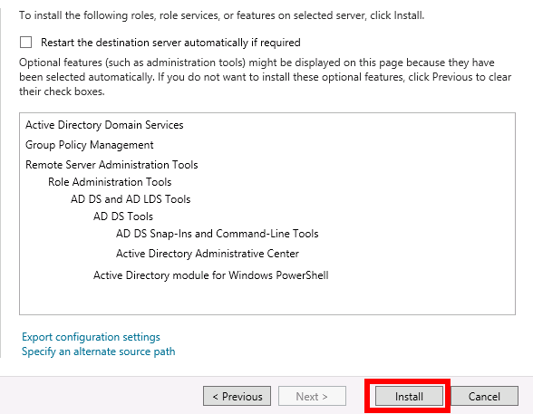

インストール完了まで暫く時間が掛かり、必要に応じて自動で再起動が行われることがあります。インストールが完了したら、メニューを閉じてサーバマネージャに戻ります。


### Active Directoryツリーの構成
次は実際にActive Directoryを構築します。サーバマネージャの右上に出ている通知をクリックし、Promote this server to a domain controllerをクリックします。

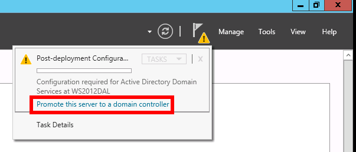

Deployment Configurationにて、現在操作しているサーバのActive Directory上での役割を選択します。デフォルトでは既存のActive Directoryに追加するよう背呈されていますので、新しく作るためにAdd a new forestを選択します。更に、Active Directoryで使うドメイン名もここで設定します。本ハンズオンでは、Active Directory用ドメイン名をad.softlayer.localとします。

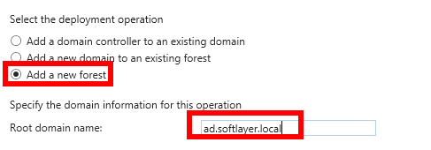

Domain Controller Optionsで、新しく構築するフォレストの機能レベルを設定します。これは、Windows 2000でActive Directoryが登場してからOSの更新によりActive Directoryの機能も更改を続けてきたため、混在するWindows Serverのバージョンにあわせて、どのWindows Server時代のActive Directory機能を使うかというサーバ間の同意ために用いられます。

本ハンズオンでは一台のWindows Serverのみがドメインコントローラとして振舞うため、機能レベルはWindows Server 2012のままで問題ありません。下のDirectory Service Recovery Modeのパスワードは、Active Directoryが不調になった際のリカバリに使うためのパスワードです。

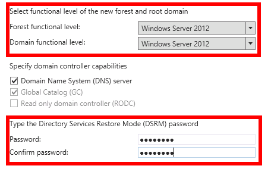

次のDNS Optionsは変更なく次に進みます。その次のAdditional Optionsで、NetBIOS名を指定します。NetBIOS名には、ad.softlayer.localのうち冒頭から最初のピリオドまでを大文字で入力します。

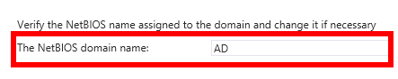

その次のPathsとReview Optionsは特に変更なくNextをクリックしてください。

最後のPrerequisites Checkにて表示される案内を熟読の上、Installをクリックしてください。

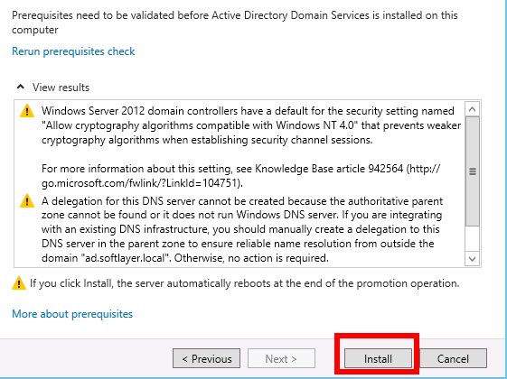

OS再起動の後、サーバマネージャにはActive Directoryを管理するためのAD DSという項目が追加されています。

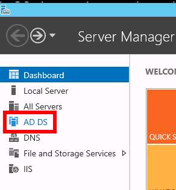

### Active Directoryのユーザ追加
Active Directoryの構築が終了したら、次はユーザを追加します。

サーバ管理マネージャに新しく追加されたAD DSの項目をクリックすると、Active Directoryに参加しているサーバ一覧が表示されます。本ハンズオンでは1台しか表示されていませんが、サーバ一覧の中からサーバを選択して右クリックし、Active Directory Users and Computersをクリックしてください。

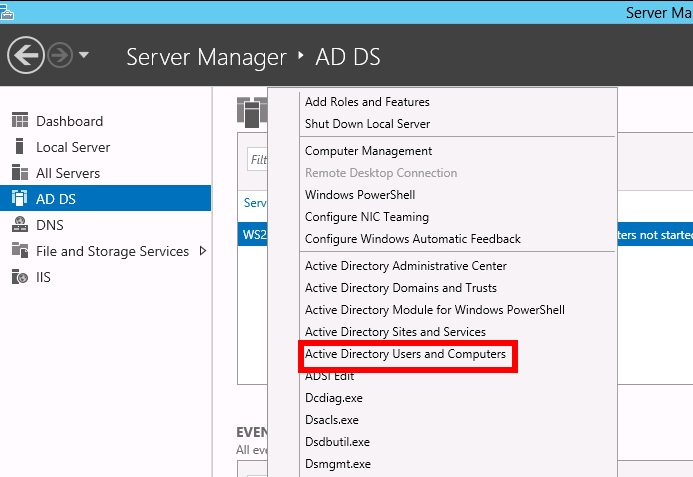

表示されたユーザ管理コンソールの、一番下のUser上で右クリックし、New→Userの順にクリックします。

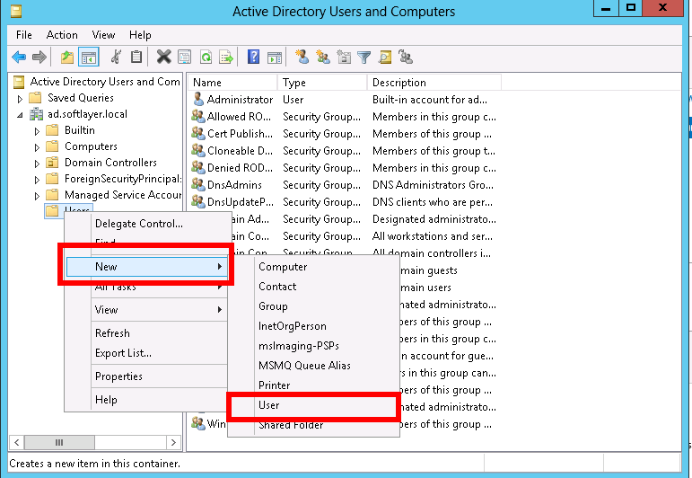

表示されたウインドウにユーザ情報を登録していきます。特に、赤枠で囲われた部分はコンピュータにログインする際に利用するユーザ名として利用されます。

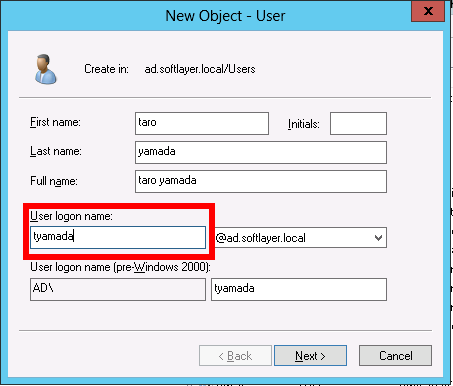

続いてユーザのパスワード設定です。設定によっては大文字、小文字、数字や記号を複数組み合わせた難解なパスワードを要求される場合があります。設定が拒否される場合はパスワードの強度を変更して再度試してください。更に、一番上のチェックボックスを外すとログ印字にパスワード変更を要求されなくなります。

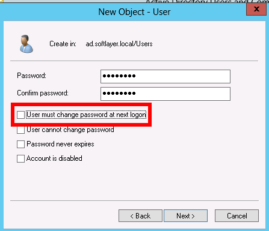

次は、追加したユーザに権限を付与します。ユーザ管理ポータルに戻ったら、追加したユーザを右クリックし、Propertiesで詳細を表示して、詳細表示の中で、Member Ofタブを開き、Addをクリックしてください。

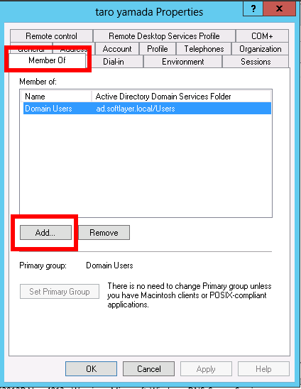

下の入力欄に「Domain Admins」と入力して、OKを押して閉じてください。

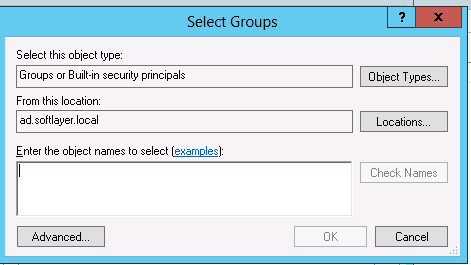

これでActive Directoryのユーザー追加が完了しました。

### 他サーバのActive Directoryへの参加
最後は他サーバをActive Directoryに参加させます。Active Directoryに参加したコンピュータは、サーバが持っている情報を利用できます。ここでは前の章で作成したユーザの情報でコンピュータにログインすることで、ディレクトリサービスの利便性を確認します。

Active Directoryに参加するには、Active Directoryサーバが提供するDNSサーバを参照する必要があります。そのため、最初にデプロイした、二台目のWindows Serverにログインし、設定を変更します。

二台目のWindows Serverにログイン後、サーバマネージャのLocal Server をクリックし、Public Network Aをクリックして開きます。

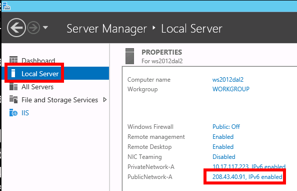

次に、Public Network Aを右クリックしてPropertyを表示後、Internet Protocol Version 4を選択肢、Propertiesボタンをクリックしてください。

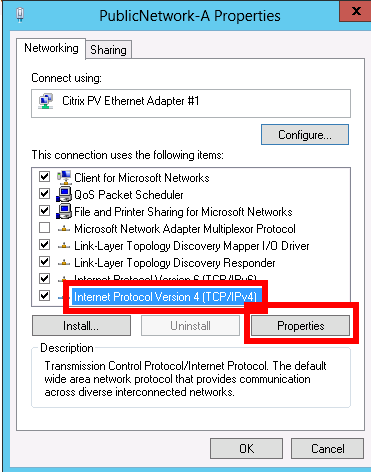

下段のPreferred DNS Serverを、標準の代わりに一台目の、Active DirectoryサーバとなっているサーバのIPアドレスを入力します。これで、二台目のサーバもActive Directoryに参加する用意が出来ました。実際にActive Directoryに参加しましょう。

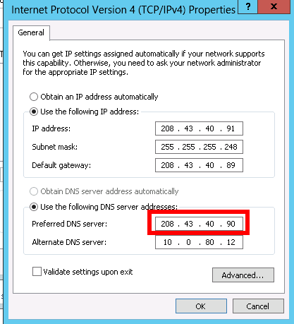

参照するDNSサーバの設定を変更した後に、サーバマネージャのLocal Serverを開き、WORKGROUPをクリックしてください。

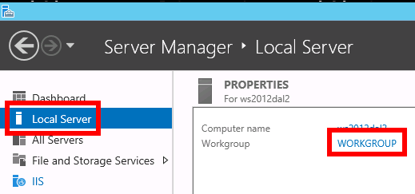

出てきた設定画面で、チェックボックスをWorkgroupからDomainに変更し、ドメイン名に一台目のWindows ServerでActive Directoryを構築する際に指定した、ad.softlayer.localを入力します。

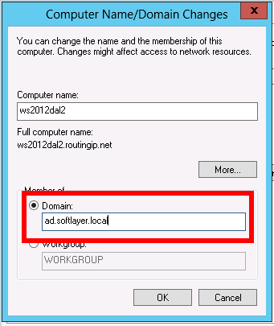

OSをクリックすると、以下のように認証画面が出るので、追加したユーザー名とパスワードを用いて認証を行います。

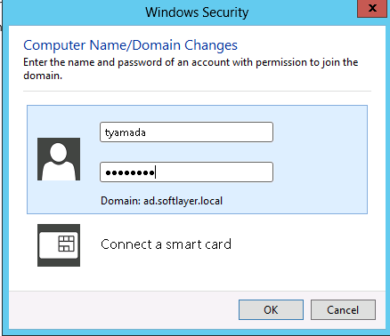

認証後、一度OSを再起動することにより、次回の起動以降はActive Directoryのメンバーとして利用できます。Active Directoryが動いている事を確認する為に、1台目のサーバで追加したユーザー情報を利用して二台目のサーバにログインを行います。

二台目のサーバにリモートデスクトップ接続を行う際に、以下のようにユーザ名をad\ユーザ名、パスワードをActive Directoryで設定したパスワードとして設定すると、実際に二台目のサーバには追加していないユーザ情報であっても、Active Directory 経由で利用することができる。

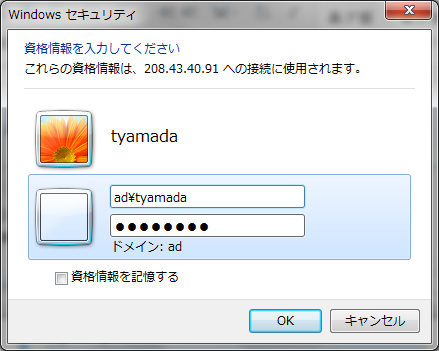

Actove Directoryサーバ側で追加したユーザー情報を利用して、二台目のサーバにリモートデスクトップ接続できれば、Active Directoryサーバの構築は完了です。