# SoftLayerハンズオン ObjectStorage CentOS 6.x編
## 事前準備

- SoftLayerのアカウントは、事前取得していることを前提にしています。次の「SoftLayer 無料トライアルのご案内」を参照してください。

>【SoftLayer無料トライアルのご案内】
> http://www.ibm.com/cloud-computing/jp/ja/softlayer_flow.html

- 本資料は SoftLayer ハンズオン初級編を既に受講していることを前提にしています。

>【SoftLayer ハンズオン初級編ガイド】
> http://www-06.ibm.com/ibm/jp/cloud/pdf/softlayer_handson_server_guide.pdf

- 当日は取得したアカウントを使用してハンズオンを行います。数十円程度の課金が発生します。
- SoftLayerのアカウントの解約について
全てのリソースがアカウントから削除されますと、お客様のアカウント環境はクローズされ、お手持ちのIDとパスワードでのログインが出来なくなり、事実上ご解約の扱いとなります。ただし、もし同じアカウントIDで再度アカウントを開通されたい場合にはSoftLayerの公式WEBサイト等のチャットにてお申し出頂く事で再度開通させて頂く事も可能です。
-	使用するブラウザは、Chromeか、Firefoxをお勧めします。Internet Explorerをお使いの場合、表示されなかったり、表示が崩れたりする事があります。

### 管理ポータルへのログイン
SoftLayer 上で下記スペックの時間課金仮想インスタンス(Virtual Server (public node))を構築し、SSH で
の接続と操作が可能であることを確認してください。

|項目名           |パラメータ                                                                                |
|:--------------:|:---------------------------------------------------------------------------------------:|
|Data Center     |San Jose 1                                                                               |
|Operating System|CentOS 6.x - Minimal Install (64 bit)                                                    |
|Host Name       |ご自身のアカウントを利用している方: 任意 IBM から貸与したアカウントを利用している方: アカウント名|
|Domain Name     |ご自身のアカウントを利用している方: 任意 IBM から貸与したアカウントを利用している方: handson.jp |

> ※ 他はデフォルト設定、講師から何か指定がある場合はそちらに従ってください。

仮想インスタンスの構築方法がわからない場合は、「SoftLayer ハンズオン初級編ガイド」の 4 章~8 章を参考にしてく
ださい。 本ハンズオンではこの仮想インスタンスを利用しますので、必ず構築ください。

## Object Storage
### 概要
Object Storage とは、Amazon S3 や SoftLayer の提供する Object Storage などに代表される、HTTP REST
を通じてやり取りする抽象化されたストレージ機能を指します。特に SoftLayer の提供する Object Storage は、
IBM が支援するオープンソースプロジェクトである OpenStack の成果物であるオブジェクトストレージエンジンの
Swift と高度な互換性を保っているので、Swift 向けのナレッジやツールをそのまま利用する事ができます。
ハンズオンでは、cURL を利用した HTTP での直接のアクセス、Swift の管理ツールを利用したアクセス、そして
cloudfuse を利用したマウントの 3 種類のアクセスを通して、プログラマ、サーバ管理者、そしてサーバ利用者それ
ぞれの視点で Object Storage に触れることができます。

> この作業は課金されます。無料トライアルアカウントユーザの場合、ご注意ください。料金は以下の通りです(※2016 年 3 月)
- Object Storage 上に保存するコンテンツに対して$0.03 - $0.04/GB
- Object Storage からの読み出しに対して$0.07 - $0.18/GB
- Object Storage からの CDN を経由した読み出しに対して$0.10/GB

### 管理ポータルへのログイン
SoftLayer の利用は、管理ポータルから操作します。まず、https://control.softlayer.com/ にアクセスして、ログインしてください。

    

> ※ 最初にログオンされた方は、パスワードの変更を促されますので、変更してください。

>※ 同じネットワークからのログイン要求で、パスワードを連続 3 回間違えると、そのネットワークからのログイン要求を 30
分間遮断しますので、パスワードは慎重に入力してください。

>※ ブラウザは、Chrome、Firefox をお勧めします。Internet Explore は表示されない場合があります

### Object Storageのオーダー
メインメニューから[Storage]→[Object Storage]を選んでください。さらに、[Order Object Storage]をクリックしてください

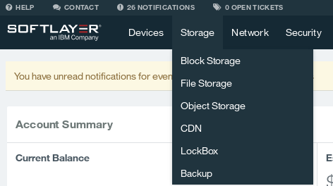    
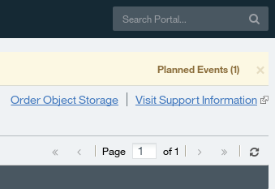    

“No API Key Found”というメッセージがでる場合があります。No を選択して続行してください。

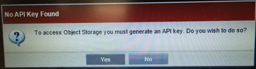    

課金に対する注意が表示されますので、よくお読みの上[Continue]をクリックしてください。

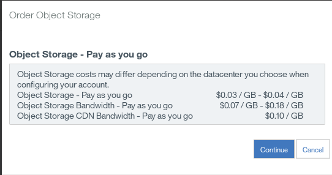    

Object Storage 注文上の注意が表示されますので、よくお読みの上、チェックボックスにチェックを入れて、[Place
Order]をクリックしてください。

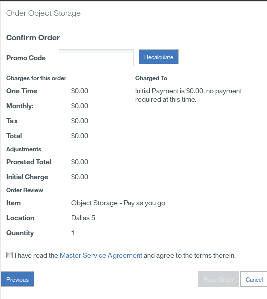    

> ※新しいウィンドウが出てこない場合は、ポップアップがブロックされている可能性があります。ポップアップを許可し
てください。

以上で、Object Storage の注文は終了です。注文処理の経過は適宜メールによる通知が行われます。

### Object Storageのセットアップ
[Storage]→[Object Storage] を選択してください。
アカウントの一覧が表示された後に、自動で Object Storage ユーザーの管理ポータルに遷移します。自動で遷移しない場合は、オブジェクトストレージのアカウント名の部分をクリックしてください。

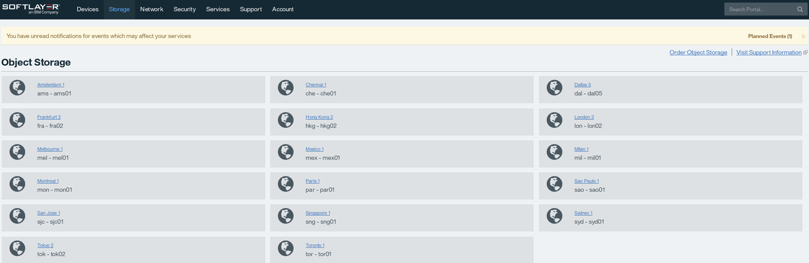    

### Locations
Object Storage をデプロイ出来るデータセンター一覧が表示されます。
本ハンズオンでは「San Jose 1..」を選択します。

> 講師の指定がある場合はそちらのデータセンターを選択してください。

### Credentials
Object Storage のポータルの[View Credentials]をクリックすることで、オブジェクトストレージへアクセスする為の
ユーザー名やパスワード、エンドポイントといった重要な情報を確認することができます。

[Authentication Endpoint]のうち、Public:となっているエンドポイントはインターネット上ならどこからでも、
Private:となっているエンドポイントは SoftLayer のネットワーク内部からのみ利用することができます。但し、
SoftLayer のネットワーク内であれば Hong Kong の Object Storage を London のサーバから参照することも可
能です。これらの情報はハンズオン中で利用しますので、適宜参照出来る様に注意してください。テキストエディタ
にコピーしておくと後で便利です。

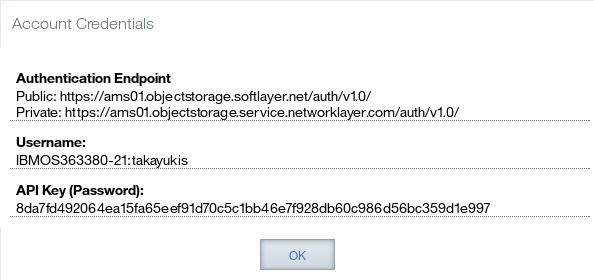    

### コンテナの追加
SoftLayer の Object Storage は、一つの Object Storage アカウントに複数地域のデータセンターが紐付けられ、
一つのデータセンター内部では更に container という形で紐付けされます。新しくコンテナを追加するには、
Object Storage の DC ごとの管理ページにて、ページ中央の[Add a container]をクリックします。

コンテナの名前を聞かれるので、適切に入力をし、OK をクリックしてください。

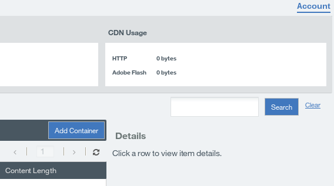    

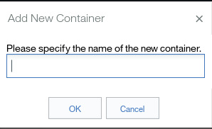    

> IBM から貸与しているアカウントを利用している場合は、”アカウント名-Datacenter 名-Container”という名
前で Container を作成ください。 例: Test01-LON-Container

コンテナが追加されると、以下の通りコンテナが管理ポータルから確認できます。

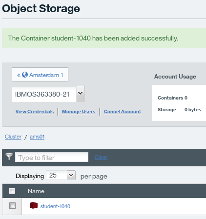

まずは管理ポータルからコンテナにファイルをアップロードしてみましょう。
最初に、コンテナ名をクリックしすると、コンテナの中のファイルを参照する事が出来る画面が表示されます。
次に、[Add files]をクリックします。

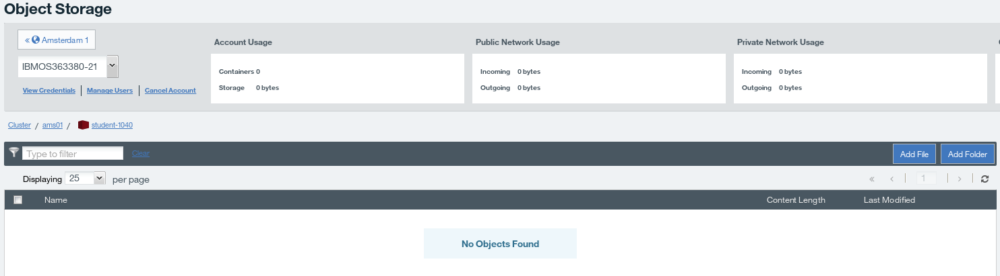

ファイルのアップロード画面で[Select]ボタンを押し、コンテナにアップロードするファイルを選択します。
選択したら、下部の[Add]をクリックしてアップロードします。
アップロードするファイルは下記ファイルをあらかじめダウンロードしてお使いください。
http://www.ibm.com/ibm/jp/cloud/pdf/softlayer_handson_storage_guide.pdf

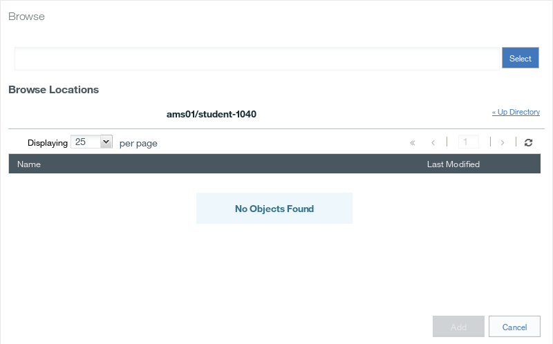

> コンテンツのアップロードに失敗する方は適当な txt ファイルを作成してアップロードしてみてください。 管理ポータルか
らアップロード可能なファイルサイズは 25M、REST API でアップロード可能なファイルサイズは 5G までです。

これにて準備は完了です。Object Storage へのアクセスを開始しましょう。

### Object Storageへのアクセス
SoftLayer の Object Storage はアプリケーション開発者、サーバ管理者、そしてサーバ利用者など多様なロール
に応じてそれぞれに適したアクセス方法を提示できます。本ハンズオンでは 3 種類のアクセス方法でObject Storageへとアクセスします．

#### HTTP REST でのアクセス
Object Storage は HTTP REST を経由して操作するストレージです。そのため、Object Storage に対する最も
プリミティブな操作は、HTTP リクエストを発行してそのレスポンスを確認することになります。ここでは cURL という、
コマンドライン上で HTTP リクエストを発行するコマンドを利用します。

「1. 事前準備」で構築した、仮想インスタンスに SSH で接続し、cURL をインストールします。

    # yum install curl

curl コマンドを用いることで、HTTP リクエストを生成することができます。試しに Web サイトへのリクエストを行ってみましょう。

    # curl http://www.ibm.com/jp-ja/

適切に実行が終了したら、Web サイトの HTML ソースが出力されます。

curl で Object Storage へアクセスするには様々な手順が必要ですが、今回のハンズオンでは実際にアクセスする
為のコマンドを生成するスクリプトが準備されています。まずはスクリプトをダウンロードしましょう。

    # wget http://shiro.ma/curl_command.zip **変更してください**
    # unzip curl_command.zip
    # cd handson

ダウンロードした zip ファイルを展開すると、handson という名前のディレクトリの中に curl_command.sh という名前のスクリプトが現れますので、このスクリプトの内に必要な情報を記述します。

記述が必要なのは、先頭のUSER,KEY,AUTH_ENDPOINT,そして CONTAINER_NAME の 4 項目です。これらの情報を Object Storage のページで[View Credentials]をクリックすることで確認した上で、ダブルクォートで括られた中に入力してください。

    # vi curl_command.sh
    例
    USER="IBMO463380-2:test01" #Set Username in Account Credentials
    KEY="b0497f55fb99b362fa656fc85a89c0cb0319bfc19f8f2d835c5ec11b64a248f1" #Set API
    Key(Password) in Account Credentials
    AUTH_ENDPOINT="https://dal05.objectstorage.softlayer.net/auth/v1.0/" #Set Authentication
    Endpoint in Account Credentials
    CONTAINER_NAME="kimihikok-lon-container" #Set YOUR container name
    <中略>

必要な情報を記述したら、スクリプトを実行します。

    # chmod +x curl_command.sh
    # ./curl_command.sh
    To get file list in the kimihikok-lon-container, please execute command below.

    curl -s -X GET -i -H "X-Auth-Token: AUTH_tk4680ef74303e4b5085bf63557b1a74a3"
    https://dal05.objectstorage.softlayer.net/v1/AUTH_809339fe-48c9-45ff-88c0-8bb363829f76/kimihikok-lon-containe

    To upload file 'upload.img' to kimihikok-lon-container, please create 'upload.img' using dd

    dd if=/dev/zero of=upload.img bs=1M count=5

    and upload file using curl

    curl -s -X PUT -T upload.img -v -H "X-Auth-Token: AUTH_tk4680ef74303e4b5085bf63557b1a74a3"
    https://dal05.objectstorage.softlayer.net/v1/AUTH_809339fe-48c9-45ff-88c0-8bb363829f76/kimihikok-lon-container/upload.img

スクリプトを実行すると、指定したコンテナのファイル一覧を取得するためのコマンドと、ファイルを生成してコンテナにアップロードするコマンドが出力されます。
適切に生成されない場合は Credential の情報やコンテナ名が適切に入力されているかを再度確認してください。

handson という名前のコンテナ内のファイル一覧を取得するコマンドの例

    # curl -s -X GET -i -H "X-Auth-Token: AUTH_abcd1234efgh5678ijkl9012mnop3456qrst" https://xxxxx.objectstorage.softlayer.net/v1/AUTH_cfb11c1b-123a-45f6-ab7e-890123456e78/handson
    (実際のコマンドは一行で入力してください)

handson という名前のコンテナに、ダミーとして生成した 5M のファイル”upload.img”というファイルをアップロードするコマンドの例

    # dd if=/dev/zero of=upload.img bs=1M count=5
    # curl -s -X PUT -T upload.img -v -H "X-Auth-Token:
    AUTH_abcd1234efgh5678ijkl9012mnop3456qrst"
    https://xxxxx.objectstorage.softlayer.net/v1/AUTH_cfb11c1b-123a-45f6-ab7e-890123456e78/handson/upload.img
    (実際のコマンドは一行で入力してください)

アップロードが完了したら、コマンドまたは管理ポータルから指定したファイルが適切にアップロードされていることを確認しましょう。

この章では実際に HTTP リクエストを用いて Object Storage を操作しました。HTTP リクエストを直接用いて Object Storage を操作することは、ともすれば煩雑となってしまう場合もありますが、多くのプログラミング言語が HTTP リクエストを発行する機能を有しており、アプリケーション開発者にとって、HTTP リクエストを用いて操作出来る Object Storage は強力な利便性をもたらすでしょう。

#### Swift管理ツールを用いたアクセス
SoftLayer の提供する Object Storage は、IBM が支援するオープンソースプロジェクトの OpenStack プロジェクトで開発された成果物である Swift と、強力な互換性を備えています。

そして、SoftLayer の Object Storage は、Swift と同様に Swift の管理ツールを用いて管理する事ができます。この章では、Swift の管理ツールを用いてSoftLayer の Object Storage を操作します。

まずは，Swift管理ツールのインストールします．

    # yum install centos-release-openstack
    # yum install python-swiftclient

管理ツールのインストールが終了したら、実際にコマンドを入力して試してみましょう。

    # swift -A エンドポイント -U ユーザー名 -K API キー(Password) list -v コンテナ名

エンドポイント、ユーザー名、API キーの情報は、先ほどと同じく Object Storage のページで「View Credentials」により確認できる情報を利用します。以下は handson という名前のコンテナのファイル一覧を取得しようとした場合の例です。

    # swift -A https://xxxxx.objectstorage.softlayer.net/auth/v1.0/ -U SLOS123456-2:SL123456 -K 12e3b4a56da789012b34f5c678c90b12edc34c567890c12e34567890123f4c56 list -v handson
    (コマンドは一行で実行してください)

さらに、swift.img という名前のファイルを生成し、Swift 管理ツール経由でコンテナにアップロードしてみましょう。

    # swift -A エンドポイント -U ユーザー名 -K API キー(Password) upload -v コンテナ名 ファイル

実際にファイルを作成し、アップロードしてみましょう。

    # dd if=/dev/zero of=swift.img bs=1M count=5
    # swift -A https://xxxxx.objectstorage.softlayer.net/auth/v1.0/ -U SLOS123456-2:SL123456 -K 12e3b4a56da789012b34f5c678c90b12edc34c567890c12e34567890123f4c56 upload -v handson swift.img
    (コマンドは一行で実行してください)

アップロードが完了したら、Swift コマンドまたは管理ポータル経由で再度アップロード完了を確認しましょう。

Swift 管理ツールを経由した Object Storage の管理は、HTTP REST を直接利用する場合と比べて機能的な柔軟性は若干損なわれますが、それでも十分な多機能さを持ち、その上 HTTP REST を直接利用する場合の多くの煩雑さを解消し、サーバ管理者の手間を大幅にカットしてくれま。

#### Cloudfuse を用いたアクセス
cloudfuse は、Swift で提供されている Object Storage をローカルの HDD の様にマウントしてデータを読み書きする為のソフトウェアです。これは Swift 向けに開発されたソフトウェアですが、SoftLayer の Object Storage でも同様に動作します。

まずはソフトウェアのビルドに必要なソフトウェアをインストールします。

    # yum groupinstall "Development Tools"
    # yum install libxml2-devel libcurl-devel fuse-devel openssl-devel json-c-devel

Cloudfuse のソースコードをダウンロードします

    # wget -O cloudfuse.tar.gz https://github.com/redbo/cloudfuse/tarball/master

展開し、インストールします

    # tar -xvf cloudfuse.tar.gz
    # cd redbo-cloudfuse-89787b8
    # ./configure && make && make install

インストールが完了した後、cloudfuse が利用する設定ファイルを、root のホームディレクトリに.cloudfuse という名前で作成します。ファイル名の先頭のドットを入れ忘れないようにご注意ください。

    # vi ~/.cloudfuse

.cloudfuse には、先ごろと同様に、「View Credentials」で確認できるユーザー名やパスワード、エンドポイント情報を記述します。情報は適宜ご自分の内容と読み替えてください。

    username=SLOS351234-2:SL351234
    api_key=33e2b*****
    authurl=https://xxxxx.objectstorage.service.networklayer.com/auth/v1.0/

次に、SoftLayer の Object Storage をマウントするディレクトリを作成します。

    # mkdir /mnt/softlayer

こまで来たら準備完了です。以下の通りコマンドを実行することで、Object Storage をローカルの HDD の様に扱う事ができます。

    # cloudfuse /mnt/softlayer

マウントが完了したら、中身を確認してみましょう。

    # ls /mnt/softlayer

/mnt/softlayer 内部にコンテナの名前のディレクトリが作成されていれば成功です。その中を更に ls すると、コンテナに格納されているファイル一覧が取得できます。

Cloudfuse でマウントしている Object Storage の領域は、通常のストレージ領域と同じように透過的に読み書きすることができます。実際に操作をしてみましょう。以下は handson という名前のコンテナに対して、ディレクトリの作成とファイルの書き込みを行っている例です。

    例: handson というコンテナ名の場合
    # mkdir /mnt/softlayer/handson/cloudfuse
    # echo *SoftLayer Handson* > /mnt/softlayer/handson/cloudfuse/file.txt

ディレクトリやファイルの作成が行われると、自動で Object Storage 側に反映されます。
> ※ Cloudfuse でマウントしたコンテナの表示に関しては、少し遅れることがあります。

Cloudfuse を介した Object Storage へのアクセスは、多くの利用者に別段の意識なく Object Storage を利用する事を可能にします。
しかし一方で、ローカル環境での適切な権限制御を行わない限り、Object Storage のコンテナ単位やデータセンター単位での不適切なファイル操作権限の付与、ひいては本来行われるべきでない不適切な情報の奪取が行われる可能性があるので注意が必要です。

#### メタ検索機能
SoftLayer の Object Storage は OpenStack の Swift と多くの互換性を持っていますが、SoftLayer の Object Storage にしか存在しない機能があります。 それは、ファイルに登録されたメタデータに基づく検索機能です。ここでは、メタ検索機能を紹介します。

メタ検索機能を利用するには、まずファイルにメタ情報を登録する必要があります。これは管理ポータル上から簡単に行うことが出来ます。
まず Object Storage のコンテナ内部を開き、メタ情報を登録したいファイルをクリックします。

画面右側にメタ情報を登録するフォームがあるので「Add MetaData」をクリックしてメタ情報を登録します。
メタ情報を登録する場合は、左側のフォームに Key、右側のフォームに Value となる様に注意しましょう。
左側の入力欄に event、右側の入力欄に handson と入力します。メタ情報は複数のペアを登録することもできます。

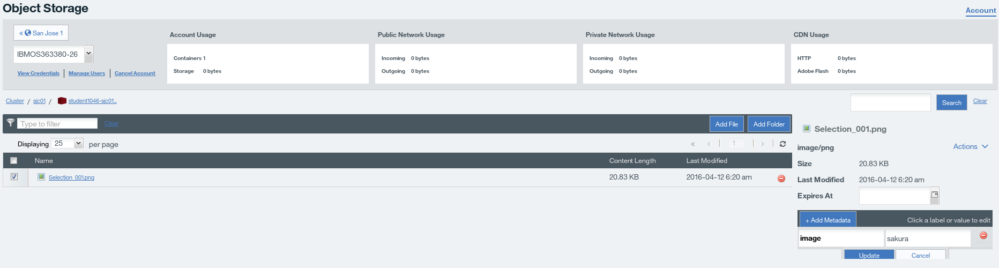

検索には上部の検索ウィンドウを利用します。

登録したメタ情報で検索を行うと、メタ情報を登録したファイルが検索に引っかかる事が確認できます。
検索がうまくできない場合は、一度 Device をクリックした後、Storage  Object Storage をクリックして再度確認してみましょう。

### Contents Delivery Network (CDN)
> 注意:この項目は、転送したデータのサイズに応じて従量で課金が行われますのでご注意ください。

Contents Delivery Network(CDN)とは、ファイルを高速、低負荷で配信するためのプラットフォームです。
例えば一台の Web サーバのみにコンテンツを配置している Web サイトにアクセスが集中したした場合、全ての負荷は一台の Web サーバに集中してしまいます。
台数を増やす場合でも、アクセスが発生する地域に応じて適切なサーバの配置を行わなければ、負荷を分散する事は出来ません。
しかし、CDN を用いることで、CDN 事業者側が、事業者の保持している世界規模のネットワークに対してファイルの適切な配置、分散を行ってくれます。
利用者はファイルが実際にどこに存在するかを意識することなく、単一の URL にアクセスするだけで、CDN 時業者側が自動で、一番高速に応答できるサーバを選択し、応答してくれます。

SoftLayer の Object Storage は CDN サービスと高度に連携しており、REST でのファイルのやり取りだけでなく、
クリックひとつで Object Storage に配置されているコンテンツを、高速な CDN 経由で全世界に配信する事ができます。

CDN を有効化するには、Object Storage のコンテナ一覧ページを開き、CDN を有効にしたいコンテナをクリックし、右側の[Enable CDN]チェックボックスをクリックします。

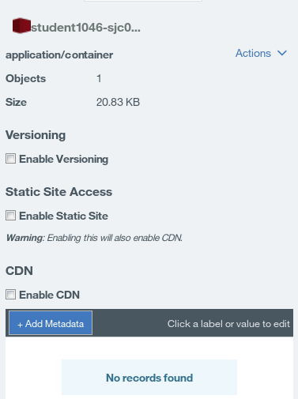

CDN が有効化されている場合、管理ポータル上から個々のファイルをクリックしていくと、右側に CDN でのアクセス用の URL が表示されます。

> 個々のファイル名がかかれてないエリアをクリックします。ファイル名が書かれているエリアをクリックするとダウンロードしてしまいます。

表示されている HTTP URL をお使いのパソコンのブラウザに貼り付けて実際にリンクを開くと、Object Storage 上に展開されているファイルを、REST 経由ではなく通常の HTTP で、CDN 越しにダウンロードすることができます。

SoftLayer の CDN 上では、一度アクセスがある毎に、サーバからデータが転送されていく過程で末端のキャッシュサーバにファイルが保持され、
徐々にキャッシュサーバがアクセスに応答する様になるという仕組みを取っています。
この方法だと、ファイル転送は要求があった際に一度行われるのみなので余計な転送は少なく料金も安く済みますが、
一度に大量のアクセスがあることが見込まれている場合には適しません。
そのような場合には、予め事前にキャッシュをキャッシュサーバに浸透させることでアクセスを高速に処理する事ができます。
但し、そのための転送量も課金対象となるので注意が必要です。

実際に CDN 上のキャッシュサーバにデータを浸透させてみましょう。
実際に行う作業は、管理ポータルの Object Storage のページの上で、CDN が有効化されたコンテナのファイルをクリックし、[Prime Cache]ボタンをクリックするだけです。
逆に、既にキャッシュサーバに浸透したキャッシュを削除する場合は[Purge Cache]をクリックします。

更に、コンテナに対して Static Site Access を有効化することで、簡易 Web サーバとして利用する事が可能です。
こちらも、有効化するコンテナをクリックし、[Enable Static Site]にチェックを入れるだけで有効になります。

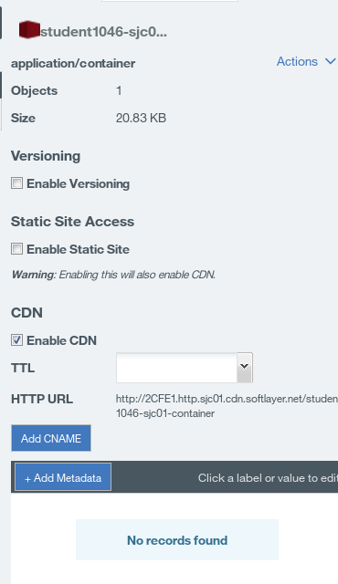

Static Site を有効にすると、自動で CDN が有効になり、サイトにアクセスするための URL が表示されます。

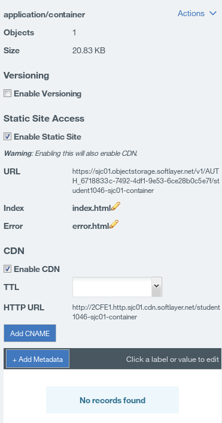

Static Site が有効になっている場合、トップページとエラーページをカスタマイズすることができます。
デフォルトではトップページのファイル名は index.html なので、この名前で以下の内容のファイルを作成してみましょう。

    # vi index.html

    <html>
      <body>
        Static Site
      </body>
    </html>

作成したら、コンテナの中に index.html をアップロードした後に、管理ポータルで指定された Static Site の URLを開きます。
適切に反映されていれば以下の様にアップロードしたファイルが表示されます。

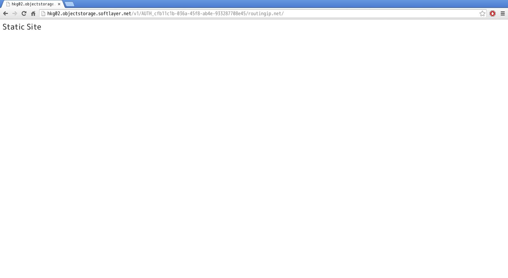

更に、Static Site が有効なら、特定のエラーの際に応答するエラーページをカスタマイズする事もできます。
例えば、Object Storage 上に存在しないファイルをリクエストした際に、デフォルトは以下の様なエラーメッセージが表示されます。

エラーページのカスタマイズ機能を利用するために、404error.html という名前のファイルを作成し、以下の様に内容を記述してアップロードします。

    # vi 404error.html

    <html>
      <body>
        Static Site / Error 404 not found
      </body>
    </html>

すると、表示されるエラーメッセージは新しく自分がアップロードした内容に変更されます。

以上が SoftLayer の Object Storage 機能の紹介になります。
Object Storage は柔軟なファイルの展開と高速な配信を一手に引き受ける強力な機能ですので、是非ご活用ください。

### Digital Transcoding
SoftLayer は、すべての利用者が追加予算なしに利用することができる強力な動画変換サービスを提供しています。
Digital Transcoding と呼ばれるこのサービスは、SoftLayer の内部ネットワークに用意されている動画変換サーバにファイルを転送し、
管理ポータルから動画変換ジョブを投入することで利用が可能です。
Digital Transcoding は、MP4(h.264)や FLV、Windows Media などの多様なフォーマット、動画配信用の HD サイズから
 Web 用 QVGA など大小さまざまな動画解像度での動画出力に対応しています。

#### 素材ファイルのダウンロード
 下記 URL より、今回ハンズオンで使用する動画ファイルをダウンロードください。

    # wget http://shiro.ma/game-mid.mp4 **変更してください**

> ※ 素材ファイルはMP4 1296kbps 640x480 4x3 24fps の動画ファイルです

#### ファイルの転送
ダウンロードが完了した動画ファイルを動画変換サーバに転送します。転送には FTP という転送プロトコルを利用
するので、最初に FTP 用のソフトを導入します。

    # yum install ftp

インストールが完了したら、ファイルを動画変換サーバに転送するためのアカウント情報を確認します。
情報は、管理ポータルの Service -> Digital Transcoding で確認できます。

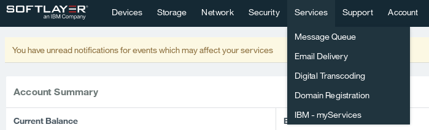

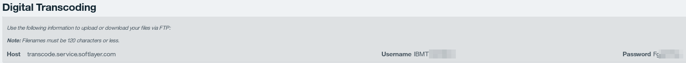

Host, Username, Password の 3 つを確認したら、動画変換サーバに動画を転送します。以下の手順を参考に動画を転送してください。
プログラムが出すメッセージを黒、ユーザーが入力する部分を赤で記述しています。
ホスト名、ユーザー名、パスワードは管理ポータルで確認した自分の情報に適宜置き換えてください。

    [root@softlayer-london ~]# ftp
    ftp> open transcode.service.softlayer.com
    Connected to transcode.service.softlayer.com (10.0.78.88).
    220 NAS FTP Service
    Name (transcode.service.softlayer.com:root): SLT123456-1(自分のユーザー名を指定)
    331 Please specify the password.
    Password: (入力は表示されません)
    230 Login successful.
    Remote system type is UNIX.
    Using binary mode to transfer files.

    ftp> ls
    227 Entering Passive Mode (10,0,78,88,93,92).
    150 Here comes the directory listing.
    drwxrwx---
    drwxr-x---
    2 205974
    2 30470
    1005
    1005
    0 Jul 26 13:14 in (変換用の動画ソースを置く場所)
    65 Jul 26 13:13 out (変換が終了した動画が置かれる場所)
    226 Directory send OK.

    ftp> cd in

    ftp> put game-mid.mp4 <SL アカウント名>-game-mid.mp4 (IBM から貸与しているアカウントを使っている場合は、必ず、
    SL アカウント名を入れてください(例: test01-game-mid.mp4))
    local: game-mid.mp4 remote: test01-game-mid.mp4
    227 Entering Passive Mode (10,0,78,88,118,151).
    150 Ok to send data.
    226 Transfer complete.
    246707 bytes sent in 0.553 secs (446.23 Kbytes/sec)

    ftp> exit

以上で動画のアップロードは完了です。次に管理ポータルから動画変換ジョブを投入してみましょう。
管理ポータルの Service -> Digital Transcoding を開き、Create Job の下の[Select Input File]をクリックします。

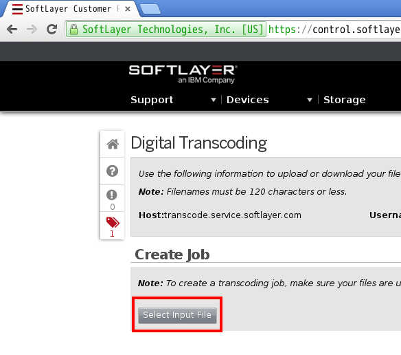

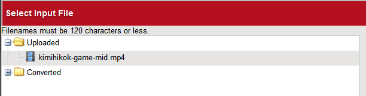

Uploade フォルダに、FTP 経由でアップロードしたファイルが存在していることを確認してクリックし、下の Select ボタンをクリックします。
これでファイルが選択された状態になります。次は変換後に出力される動画のフォーマットを指定します。
[Select Output Format] をクリックしましょう。

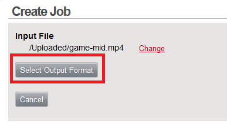

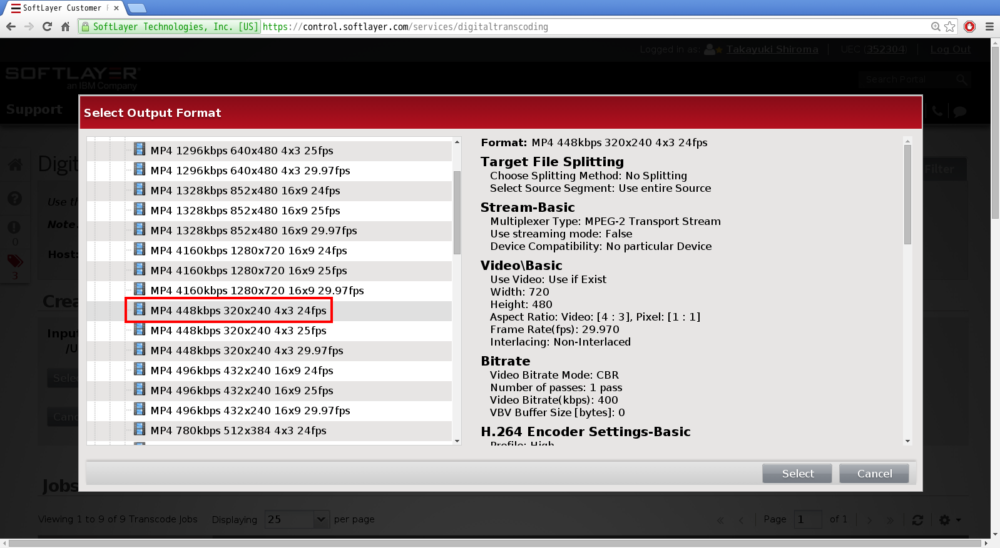

[Select Output Format]をクリックすると、多様なファイル形式と解像度の中から出力する動画のフォーマットやサイズを選択することができます。
本ハンズオンでは Web→MP4(h.264)の中から「MP4 448kbps 320x240 4x324fps」を指定してください。

最後に、ジョブの名前と出力するファイル名を指定します。ジョブ名は任意の名前を指定することができます。
また、拡張子は出力されるファイル名に自動で付与されるので、ファイル名に含める必要はありません。

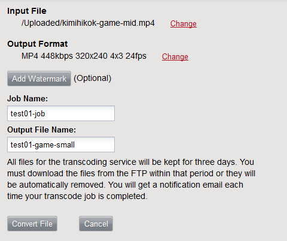

> ※IBM から貸与しているアカウントを使用している方は、下記め命名規則にしたがってください。 
Job Name: <自分のアカウント>-job 
Output File name: <自分のアカウント>-game-small

すべてを入力し終えたら、[Convert File] をクリックします。すると、以下の様に変換ジョブ投入の確認が行われるので、
[Create Job]をクリックして動画変換ジョブを登録してください。

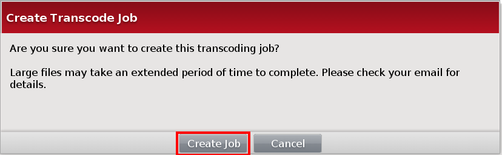

動画変換はキューとして順番に処理されていきます。動画変換開始と変換終了の際にはメールで通知が行われます。
ステータスは Job List にも表示されます。(10 分程度かかる場合もあります。)

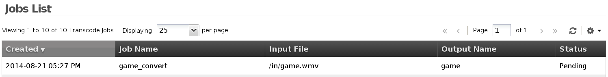

変換が終了した動画は、動画変換サーバの out ディレクトリに保存されるので、元の動画を転送したときと同じく、
FTP を用いてダウンロードします。

    [root@softlayer-london ~]# ftp

    ftp> open transcode.service.softlayer.com
    Connected to transcode.service.softlayer.com (10.0.78.88).
    220 NAS FTP Service

    Name (transcode.service.softlayer.com:root): SLT123456-1(自分のユーザー名を指定)
    331 Please specify the password.

    Password: (入力は表示されません)
    230 Login successful.
    Remote system type is UNIX.
    Using binary mode to transfer files.

    ftp> cd out
    250 Directory successfully changed.

    ftp> ls
    227 Entering Passive Mode (10,0,78,88,40,99).
    150 Here comes the directory listing.
    -rw-r--r--
    1 30470
    1005
    3589738 Jul 28 01:12 test01-game.mp4
    226 Directory send OK.

    ftp> get test01-game.mp4
    local: game.mp4 remote: game.mp4
    227 Entering Passive Mode (10,0,78,88,123,231).
    150 Opening BINARY mode data connection for game.mp4 (3589738 bytes).
    226 Transfer complete.
    3589738 bytes received in 1.61 secs (2227.05 Kbytes/sec)

    ftp> exit
    221 Goodbye.

サーバにダウンロードした変換済みの動画を Object Storage 領域にアップロードして、
CDN 経由で HTTP アクセスする為の URL を作成し、実際にダウンロードしてみましょう。

### 最後に
本ハンズオンで作成した、全ての仮想インスタンスとオブジェクトストレージを削除して終了してください。
その他イメージなどを作成された方は、イメージなども削除してください。
(本ハンズオンで利用した環境を、ハンズオン終了後も利用される方は、残しておいても問題ありませんが、課金されることをご理解いただければと思います)

#### オブジェクトストレージの削除
- 管理ポータル - Object Storage - Container でファイルを削除
> IBM から貸与しているアカウントを利用している方は、Container を削除しないでください。

- 管理ポータル - Object Storage - Container の横にある削除ボタンをクリックし、”Are you sure you want to delete コンテナ名”という
ダイアログがポップアップされるので、”Yes”をクリック

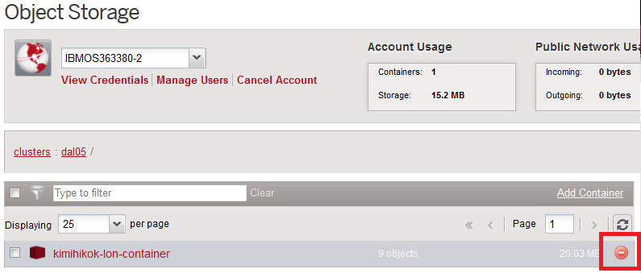

#### 仮想インスタンスの削除
[Device] – [Device list] – 自分のサーバ – [Actions] – [Cancel Device]

