# SoftLayerハンズオン WordPress編
## 諸注意


- SoftLayerのアカウントは、事前取得していることを前提にしています。次の「SoftLayer 無料トライアルのご案内」を参照してください。

>【SoftLayer無料トライアルのご案内】
> http://www.ibm.com/cloud-computing/jp/ja/softlayer_flow.html


- 本資料は SoftLayer ハンズオン初級編を既に受講していることを前提にしています。

>【SoftLayer ハンズオン初級編ガイド】
> http://www-06.ibm.com/ibm/jp/cloud/pdf/softlayer_handson_server_guide.pdf

- 当日は取得したアカウントを使用してハンズオンを行います。数十円程度の課金が発生します。
- SoftLayerのアカウントの解約について:全てのリソースがアカウントから削除されますと、お客様のアカウント環境はクローズされ、お手持ちのIDとパスワードでのログインが出来なくなり、事実上ご解約の扱いとなります。ただし、もし同じアカウントIDで再度アカウントを開通されたい場合にはSoftLayerの公式WEBサイト等のチャットにてお申し出頂く事で再度開通させて頂く事も可能です。
- 使用するブラウザは、Chromeか、Firefoxをお勧めします。Internet Explorerをお使いの場合、表示されなかったり、表示が崩れたりする事があります。
- IBMから貸与しているアカウントを利用している場合は、本資料に記載している以外のサービスを注文しないように注意してください。
- 講師の指定がない限り、本ハンズオンで作成するサーバーは、時間課金サーバー (Virtual Server (public node) - Hourly)を選択してください。

- **[COMMAND]**の記述がある部分は、実際にコマンド等の入力作業を行う箇所です。資料の内容を参考に、サーバにコマンドを入力してください。


## ハンズオンの概要
- 本ハンズオンでは、Provisioning Scriptを利用したWordPressサーバの自動展開、およびSendGridを利用したメールサービスを展開します。Provisioning Scriptを利用することで、コンテンツをキャッシュするリバースプロキシと負荷を分散するロードバランサを組み合わせたスケーラブルなWordPress環境を、自動で構築することができます。

- 本ハンズオンでは複数の仮想インスタンスを注文し利用します。既にSoftLayerをご利用で複数VLANセグメントをお持ちの場合は、注文の際に所属するVLANを明示的に指定して全てのVMが同じVLANに所属していることを確認して下さい。


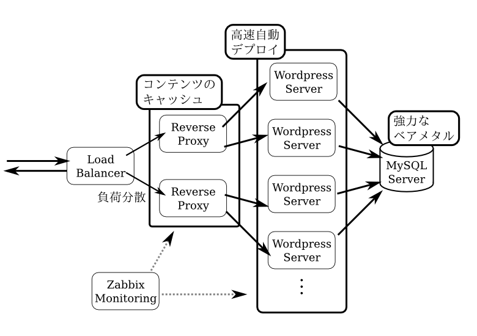


## 仮想インスタンスの準備
> SoftLayer上で下記スペックの時間課金仮想インスタンス（Virtual Server (public node) - Hourly）を構築し、SSHでの接続と操作が可能であることを確認してください。

|項目名                      |パラメータ                                                                               |
|:--------------------------:|:---------------------------------------------------------------------------------------:|
|Data Center                 |San Jose 1                                                                               |
|Operating System            |CentOS 6.x - Minimal Install (64 bit)                                                    |
|Advanced Monitoring         |None                                                                                     |
|Hardware & Software Firewall|None                                                                                     |
|Monitoring                  |Host Ping                                                                                |
|Response                    |Automated Notification                                                                   |
|Provisioning Scripts        |指定なし                                                                                 |
|Host Name                   |ご自身のアカウントを利用している方: 任意<br>IBM から貸与したアカウントを利用している方: アカウント名|
|Domain Name                 |ご自身のアカウントを利用している方: 任意<br>IBM から貸与したアカウントを利用している方: handson.jp  |

- 他はデフォルト設定、講師から何か指定がある場合はそちらに従ってください。
- 仮想インスタンスの構築方法がわからない場合は、「SoftLayerハンズオン初級編ガイド」を参考にしてください。本ハンズオンではこの仮想インスタンスを利用しますので、必ず構築ください。以降、この仮想インスタンスのことを作業マシンと呼びます。本ハンズオンでは、特に指定がない限りは全て上記スペックの仮想インスタンスを用いるものとします。

# SSH鍵の自動展開
SoftLayerでは、管理ポータルにSSHの公開鍵を事前に登録しておき、サーバのデプロイ時に指定した公開鍵を自動で組み込む機能が存在しています。後述のProvisioning Scriptと組み合わせることで、デプロイ時点でSSHのパスワード認証を禁止して鍵交換方式に限定することができるため、セキュリティが向上します。

## SSH鍵の生成

まずは作業マシン上でSSHの鍵ペアを作成します。同じパスワードを適切に二回入力すると、秘密鍵(id_rsa)と公開鍵(id_rsa.pub)のペアが作成されます。それぞれの鍵ファイルは名前の通り、公開鍵は他人に公開する為の鍵、秘密鍵は厳重に管理し認証に用いる鍵となります。

**[COMMAND]**

```
[root@workingvm ~]# ssh-keygen
Generating public/private rsa key pair.
Enter file in which to save the key (/root/.ssh/id_rsa):
Enter passphrase (empty for no passphrase):　[パスワードを入力/表示されません]
Enter same passphrase again: 　[同じパスワードを入力/表示されません]
Your identification has been saved in /root/.ssh/id_rsa.
Your public key has been saved in /root /.ssh/id_rsa.pub.
The key fingerprint is:
b5:40:b3:2e:de:95:df:7a:45:3c:8d:2f:d0:84:c6:31 root@workingvm
The key's randomart image is:
+--[ RSA 2048]----+
|        o  .Eo   |
|       . o  +..  |
|        o .. o o.|
|       . o o. o.+|
|      . S +  . o.|
|     . o . . .. o|
|      . .   . .o |
|             ..  |
|            ..   |
+-----------------+
```

SoftLayerのポータルには公開鍵を登録します。作成した公開鍵を確認してみましょう。

**[COMMAND]**

```
[root@workingvm ~]# cat .ssh/id_rsa.pub
ssh-rsa AAAAB3NzaC1yc2EAAAABIwAAAQEAuIcTA+XZ2fSjOFkpx4VRyLoC3N5Iye1XvDi
wN85DvbZIHCejpJ2R6m+5rK8Un1ewQI/xJQmm2uJu6UPPX2N7nGC0dVYkvVA0mcd+r0ozOb
I9N40jMgLwnVaVHHf/1YD6wogbl137Pd3y/jzijPw7mNv9F4DAeNeLl1VDqLwm3Q+L2XGKp
qH9k8t5D+oI1JpTZ7PvyvlPrVR1j2po5GIjCEOX5IgWytCHwb5VlLvEE28BsVLd/dDu/LRx
907uPZrS5QG/ozn+rCZhY/teOUlLOGDRzQK98jABIJQB953/2WDQrEQld5npsd1NOhXySy4
YDXvIbu4OjMhqUWumG+XJkQ== root@workingvm
```

公開鍵を確認したら、SoftLayerのポータルに公開鍵を登録します。ポータルのトップからDevice -> SSH Keysの順にクリックします。

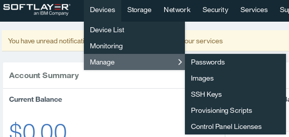

SSH鍵の管理メニューが表示されたら、右上のAddをクリックします。

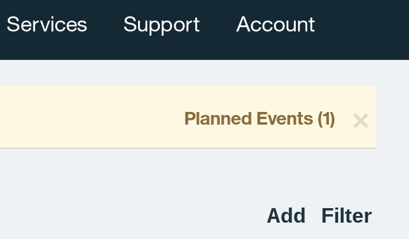

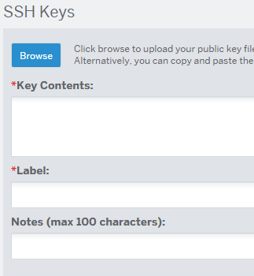

鍵の登録メニューが表示されたら、Key Contentsに公開鍵の内容をコピー&ペーストし、Labelに識別用の名前（任意ですが、本ハンズオンではアカウント名）を入力します。入力が完了したら、右下のAddをクリックし、登録を完了します。

これでSSH公開鍵の登録は完了です。次の注文時から、マシンの注文時に指定することで登録した公開鍵を含んだ状態でデプロイすることが可能です。

## SSH鍵のインスタンスへの登録方法
物理、仮想問わず、SSH鍵のインスタンスへの登録は、注文時にしか行えません。上で登録した鍵は、インスタンス注文の最終段階においてSSH Keysという項目で選択可能です。

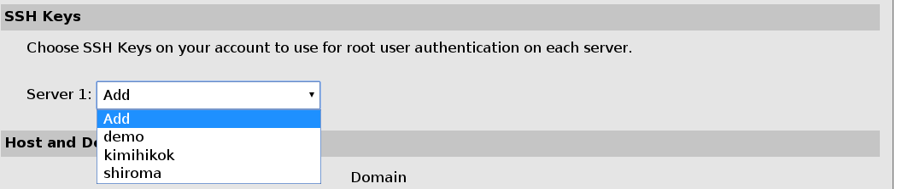

# Provisioning Script
SoftLayerには、Provisioning Scriptと呼ばれるデプロイ自動化の仕組みが存在しています。この仕組は、インスタンスの注文時のデプロイ最終段階において、ユーザーが指定したスクリプトを自動で実行するものです。

> 注文したインスタンスでProvisioning Scriptを自動実行するためには、HTTPSでスクリプトを取得する必要があります。Provisioning ScriptにHTTPのURLを指定した場合、自動実行は行われずスクリプトのダウンロードに留まります。

Provisioning Scriptは基本的にはシェルスクリプトなので、手元の環境で動作を確認の上でProvisioning Scriptとして登録をすることができます。Provisioning Scriptはデプロイ中に自動で実行される都合上、利用者の入力を必要とする対話的なコマンドを用いることはできませんので、yumをyum -yに置き換えるなどの工夫が必要です。発展的な利用方法として、Provisioning Scriptの最初にRubyやPHP、Pythonといった他のスクリプト実行環境を導入し、wget等で外部からソースコードをダウンロードして実行することも可能です。

本ハンズオンでは、図におけるReverse Proxy、WordPress Server、MySQL Server、そしてZabbix Monitoringの4つの役割に対して、それぞれ必要なソフトウェアの導入と設定の大部分を行うよう作成されたProvisioning Scriptを用いることでProvisioning Scriptの力強さを体験します。

## Provisioning Scriptの利用方法
Provisioning Scriptは注文確定画面最終段階で設定可能です。URL1に自動で実行させたいProvisioning Scriptを指定することで、インストール時にそれらのスクリプトを自動で実行させることができます。

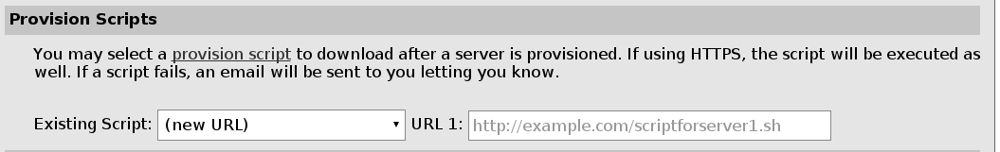

# VLAN Spanning
複数のPrivate VLANとの通信を有効にする為に、VLAN Spanningの設定を行います。管理ポータルから、Network – IP Management – VLANsで、Spanタブをクリックし、VLAN Spanning: Onをチェックします。

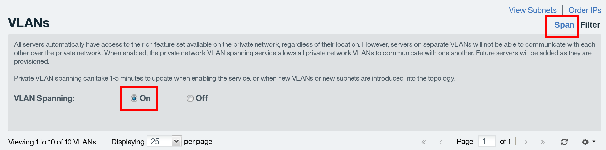

# スケーラブルWordPressシステムの展開
本章では、実際にProvisioning Scriptを活用しながらスケーラブルなWordPressシステムを構築します。本ハンズオンで構成するスケーラブルWordPress環境は、以下の通り複数の段階を踏んで負荷分散を行っています。

- 上位で負荷分散を行うロードバランサー
- 途中でコンテンツをキャッシュするReverse Proxy
- 複数の末端WordPressサーバ

これらの環境を構築するために、本ハンズオンでは以下の順番でマシンを注文し、設定します。

- マシン群を監視するZabbixサーバ
- バックエンドに設置されるDBサーバ
- WordPressサーバ
- Reverse Proxyサーバ
- ロードバランサ

## Zabbixサーバのセットアップ

管理ポータルより、下記スペックの時間課金仮想インスタンス（Virtual Server (public node) - Hourly）を作成してください。

|項目名                      |パラメータ                                                                               |
|:--------------------------:|:---------------------------------------------------------------------------------------:|
|Data Center                 |San Jose 1                                                                               |
|Operating System            |CentOS 6.x - Minimal Install (64 bit)                                                    |
|Advanced Monitoring         |None                                                                                     |
|Hardware & Software Firewall|None                                                                                     |
|Monitoring                  |Host Ping                                                                                |
|Response                    |Automated Notification                                                                   |
|Provisioning Scripts        |https://shiro.ma/sl/zabbix.sh                                                                                |
|SSH Key|登録したSSH Keyのラベルを選択 例: student1031|
|Host Name                   |ご自身のアカウントを利用している方: 任意<br>IBM から貸与したアカウントを利用している方: アカウント名-zabbix|
|Domain Name                 |ご自身のアカウントを利用している方: 任意<br>IBM から貸与したアカウントを利用している方: handson.jp  |

> 他はデフォルト設定、講師から何か指定がある場合はそちらに従ってください。


上記のProvisioning Scriptは、以下の内容を自動化します。

- WebサーバとMySQLサーバのインストール、セットアップ
- Zabbixサーバ、クライアントのインストール
- Zabbixサーバのセットアップ

Provisioning Scriptでセットアップを行った場合は、すぐにZabbixを利用できる状態になっています。ブラウザからZabbixのセットアップを行って利用を開始しましょう。セットアップは以下のURLから開始できます。

> http://ZabbixサーバのPublic IPアドレス/zabbix/

インストールはウィザード形式になっています。「3: Configure DB connection」では、Database Name,User,Passwordの全てにzabbixと入力して、Test Connectionで設定を確認してください。それ以外は全て右下のNextをクリックし、ウィザードを進めてください。

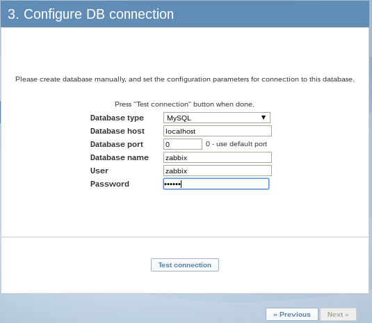

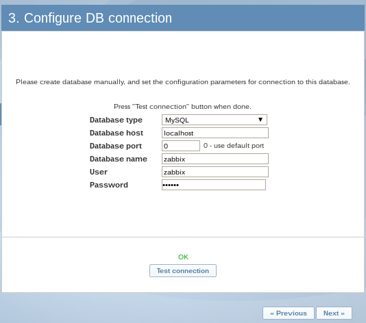


インストールウィザードが終了したら、ログイン画面が表示されます。デフォルトのパスワードはAdmin/zabbixです。早速ログインしてみましょう。

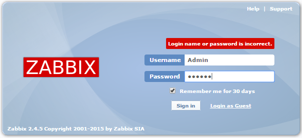

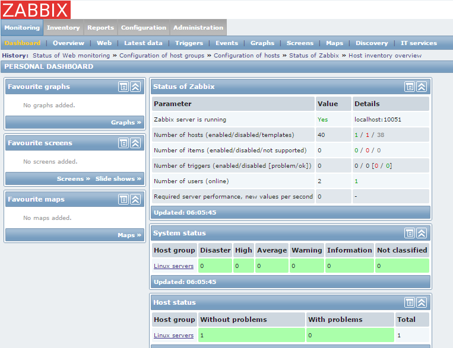

Zabbixサーバのセットアップは以上で完了です。引き続き他のノードをセットアップし、最後にそれらのノードをZabbixを追加し、自動で監視を行います。


## 5.2. バックエンドDBサーバ
次はバックエンドのDBサーバを構築します。本来DBサーバは多くのトランザクションへの対応が予想されるため、仮想インスタンスではなくベアメタルインスタンスを利用する事が多いですが、本ハンズオンでは仮想インスタンスで代用します。ベアメタルインスタンスでも同様にSSH鍵の自動登録やProvisioning Scriptを活用することができます。

管理ポータルより、下記スペックの時間課金仮想インスタンス（Virtual Server (public node) - Hourly）を作成してください。

|項目名                      |パラメータ                                                                               |
|:--------------------------:|:---------------------------------------------------------------------------------------:|
|Data Center                 |San Jose 1                                                                               |
|Operating System            |CentOS 6.x - Minimal Install (64 bit)                                                    |
|Advanced Monitoring         |None                                                                                     |
|Hardware & Software Firewall|None                                                                                     |
|Monitoring                  |Host Ping                                                                                |
|Response                    |Automated Notification                                                                   |
|Provisioning Scripts        |https://shiro.ma/sl/db.sh                                                                                |
|SSH Key|登録したSSH Keyのラベルを選択 例: student1031|
|Host Name                   |ご自身のアカウントを利用している方: 任意<br>IBM から貸与したアカウントを利用している方: アカウント名-db|
|Domain Name                 |ご自身のアカウントを利用している方: 任意<br>IBM から貸与したアカウントを利用している方: handson.jp  |

> 他はデフォルト設定、講師から何か指定がある場合はそちらに従ってください。


上記のProvisioning Scriptは、以下の内容を自動化します。

- MySQLサーバの自動インストールと設定
- Zabbixエージェントの自動インストール
- WordPress用DBユーザーの自動追加

ログインしたら、以上の内容がセットアップされていることを確認しましょう。

**[COMMAND]**

```
[root@workingvm ~] ssh root@Database VMのPublic IPアドレス
Enter passphrase for key '/root/.ssh/id_rsa': [鍵作成時に入力したパスワードを入力]
[root@db ~]# yum list installed | grep -i -e mysql -e zabbix
mysql.x86_64          5.1.73-5.el6_6    @updates
mysql-libs.x86_64     5.1.73-5.el6_6    @updates
mysql-server.x86_64   5.1.73-5.el6_6    @updates
perl-DBD-MySQL.x86_64 4.013-3.el6       @base
zabbix.x86_64         2.4.5-1.el6       @zabbix
zabbix-agent.x86_64   2.4.5-1.el6       @zabbix
zabbix-get.x86_64     2.4.5-1.el6       @zabbix
zabbix-release.noarch 2.4-1.el6         installed

[root@db ~]# mysql -u root -p
Enter password: [Enter]
Welcome to the MySQL monitor.  Commands end with ; or \g.
(中略)
mysql>select Host, User, Password from mysql.user;

+-----------------+----------------+-------------------------------------------+
| Host            | User           | Password                                  |
+-----------------+----------------+-------------------------------------------+
(中略)
| test.handson.jp |                |                                           |
| %               | WordPress_user | *5098F389DDBE540AB35FE3EA85BF9CC4597208F6 |
+-----------------+----------------+-------------------------------------------+

```


## WordPressサーバ
次はWordPressサーバのデプロイです。一般にWordPressのインストールには非常に複雑な手順を要しますが、Provisioning Scriptによりこれらの多くは自動で行われます。まずは一台目をインストールしましょう。

### 一台目
管理ポータルより、下記スペックの時間課金仮想インスタンス（Virtual Server (public node) - Hourly）を作成してください。

|項目名                      |パラメータ                                                                               |
|:--------------------------:|:---------------------------------------------------------------------------------------:|
|Data Center                 |San Jose 1                                                                               |
|Operating System            |CentOS 6.x - Minimal Install (64 bit)                                                    |
|Advanced Monitoring         |None                                                                                     |
|Hardware & Software Firewall|None                                                                                     |
|Monitoring                  |Host Ping                                                                                |
|Response                    |Automated Notification                                                                   |
|Provisioning Scripts        |https://shiro.ma/sl/backweb_nginx.sh                                                                                |
|SSH Key|登録したSSH Keyのラベルを選択 例: student1031|
|Host Name                   |ご自身のアカウントを利用している方: 任意<br>IBM から貸与したアカウントを利用している方: アカウント名-wordpress1|
|Domain Name                 |ご自身のアカウントを利用している方: 任意<br>IBM から貸与したアカウントを利用している方: handson.jp  |

> 他はデフォルト設定、講師から何か指定がある場合はそちらに従ってください。

上記のProvisioning Scriptは、以下の内容を自動化します。

- Zabbixエージェントの自動インストール
- WordPressの自動インストールとNginxの自動設定
- WordPress用データベースの情報設定

WordPressサーバのProvisioning Scriptでは、WordPressを構成するために必要なほぼすべての設定が自動化されていますが、DBサーバの設定だけは自分で変更する必要があります。前節で注文したバックエンドDBサーバのPrivate IP Addressを確認し、WordPressの設定ファイルに変更を加えましょう。

**[COMMAND]**

```
[root@workingvm ~] ssh root@WordPressサーバのPublic IPアドレス
[root@wordpress1 ~]# vi /etc/wordpress/wp-config.php

/** MySQL hostname */
define('DB_HOST', 'DBサーバのPrivate IP address');
```

以上で追加設定は終了です。WordPressのセットアップに入りましょう。

## WordPressのセットアップ
WordPressのセットアップは、ブラウザのウィザード越しに行います。ブラウザで以下のURLを開いてください。

> http://WordPressサーバのPublic IPアドレス/

以下の様なインストール画面が表示されます。上からサイト名、管理用ユーザー名、管理用パスワード(2回入力)、Eメールアドレスを順に入力してください。

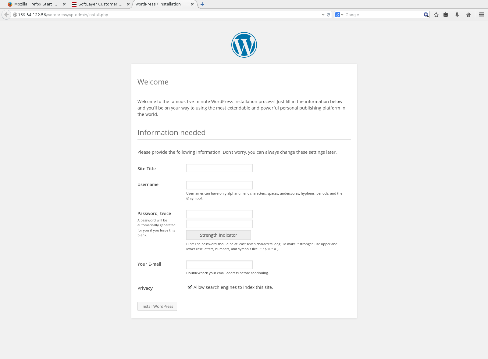

以上でWordPressのセットアップは終了です。設定したパスワードでWordPressにログインしましょう。


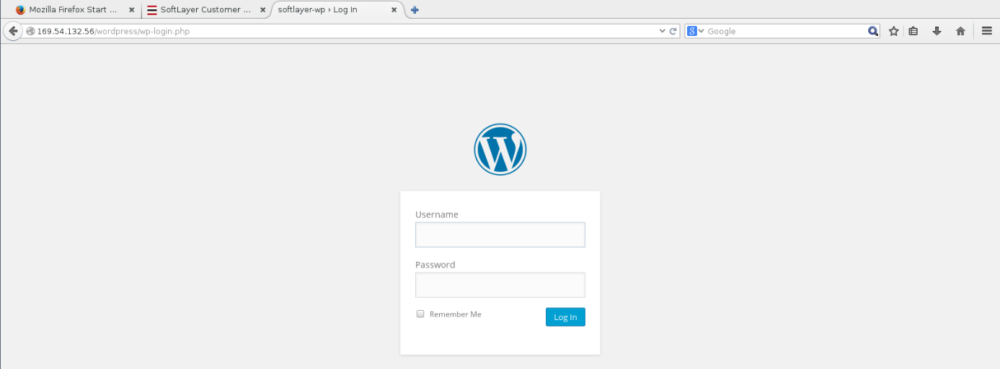

### 二台目
二台目以降のWordPressノードのセットアップは非常に簡単です。二台目以降は、一台目と同じスペック、同じProvisioning Scriptを用いてデプロイし、一台目と同様に/etc/WordPress/wp-config.phpにDBサーバの設定を施せば、すぐにWordPressサーバとして稼働します。

### SoftLayer Object Storageの設定
標準の設定では、WordPressはアップロードした画像をローカルに保持します。しかし、複数のWordPressサーバを構築して負荷分散を行う場合はアプロードされた画像を各サーバ間で共有する必要があります。そこで、各WordPressサーバ間で、SoftLayerのObject Storageを介してアップロードされたコンテンツを共有します。まずは各サーバ群と同じデータセンターにObject Storageを注文して、利用できる様にしてください。

> Object Storageの注文と利用に関しては、SoftLayerハンズオン ストレージ編の5章で詳解しています。併せてお読みください。<br>
http://ibm.biz/slhandson22

#### Object Storageのセットアップ
管理ポータルから、Storage - Object Storageを選択してください。 アカウントの一覧が表示された後に、自動で Object Storage ユーザーの管理ポータルに遷移します。自動で遷移しない場合は、オブジェクトストレージのアカウント名の部分をクリックしてください。

#### Locationの選択
Object Storage をデプロイ出来るデータセンター一覧が表示されます。本ハンズオンでは「San Jose 1..」を選択します。

#### Credentialsの確認
管理ポータルから、Storage – Object Storage – Object Storageのアカウント名 – ロケーション (San Jose) で、 [View Credentials]をクリックすることで、オブジェクトストレージへアクセスする為の ユーザー名やパスワード、エンドポイントといった重要な情報を確認することができます。

[Authentication Endpoint]のうち、Public:となっているエンドポイントはインターネット上ならどこからでも、 Private:となっているエンドポイントは SoftLayer のネットワーク内部からのみ利用することができます。

#### CDNの有効化
SoftLayer Object StorageはCDNと連携させることができます。必要に応じて、Enable　CDNをチェックし、CDNを有効にしてください。

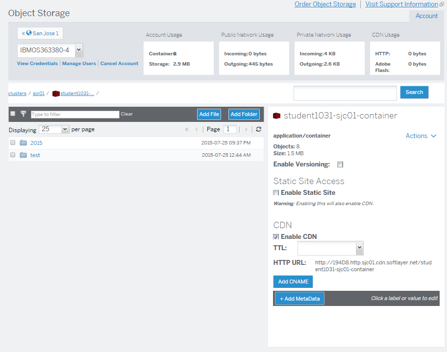

#### Cloudfuseのインストール

**以下の設定は、二台のWordPressサーバの両方で実行してください**

Object Storageが利用できるようになったら、各WordPressサーバにObject Storageをマウントして利用するためのCloudfuseというソフトウェアを導入します。まずはCloudfuseのビルドに必要なソフトウェアをインストールします。

**[COMMAND]**

```
[root@wordpress1 ~]# yum groupinstall "Development Tools"
[root@wordpress1 ~]# yum install libxml2-devel libcurl-devel fuse-devel openssl-devel json-c-devel
```

Cloudfuseのソースコードをダウンロード・展開・インストールします

**[COMMAND]**

```
[root@wordpress1 ~]# wget -O cloudfuse.tar.gz https://github.com/redbo/cloudfuse/tarball/master
[root@wordpress1 ~]# tar -xvf cloudfuse.tar.gz
[root@wordpress1 ~]# cd redbo-cloudfuse-871a98f
[root@wordpress1 ~]# ./configure && make && make install
```


インストールが完了した後、cloudfuseが利用する設定ファイルを、rootのホームディレクトリに.cloudfuseという名前で作成します。ファイル名の先頭のドットを入れ忘れないようにご注意ください。
.cloudfuseには、先ごろと同様に、「View Credentials」で確認できるユーザー名やパスワード、エンドポイント情報を記述します。情報は適宜ご自分の内容と読み替えてください。

**[COMMAND]**

```
[root@wordpress1 ~]# vi ~/.cloudfuse
記述例:
username=SLOS351234-2:SL351234
api_key=33e2b*****
authurl=https://xxxxx.objectstorage.service.networklayer.com/auth/v1.0/
```

CloudfuseでObject Storageをマウントして、WordPressにアップロードされた画像を共有します。その際、画像アップロードフォルダにNginxが書き込める必要があるため、NginxのuidでObject Storageをマウントしましょう。

**[COMMAND]**

```
[root@wordpress1 ~]# id nginx
uid=497(nginx) gid=498(nginx) groups=498(nginx)
[root@wordpress1 ~]# cloudfuse -o uid=497 -o allow_other /usr/share/wordpress/wp-content/uploads
```

画像をSoftLayer Object Storageの指定コンテナにアップロードするようにwp-config.phpを変更します。

**[COMMAND]**

```
[root@wordpress1 ~]# vi /etc/wordpress/wp-config.php
末尾に追加
/** Change uploads folder to SoftLayer object storage*/
define('UPLOADS', '/wp-content/uploads/コンテナ名 例: student1031-sjc01-container');
```


## Load Balancer
### Load Balancerの導入と設定
#### Load Balancerのデプロイ
次は負荷分散機構のLoad Balancerをデプロイしてみましょう。Load balancerには新進気鋭のWebサーバ、Nginxを利用します。Nginxは負荷分散と同時に流通しているコンテンツをキャッシュできるため、更なる通信負荷の低減を見込むことができます。


|項目名                      |パラメータ                                                                               |
|:--------------------------:|:---------------------------------------------------------------------------------------:|
|Data Center                 |San Jose 1                                                                               |
|Operating System            |CentOS 6.x - Minimal Install (64 bit)                                                    |
|Advanced Monitoring         |None                                                                                     |
|Hardware & Software Firewall|None                                                                                     |
|Monitoring                  |Host Ping                                                                                |
|Response                    |Automated Notification                                                                   |
|Provisioning Scripts        |https://shiro.ma/sl/frontweb.sh                                                                                |
|SSH Key|登録したSSH Keyのラベルを選択 例: student1031|
|Host Name                   |ご自身のアカウントを利用している方: 任意<br>IBM から貸与したアカウントを利用している方: アカウント名-lb|
|Domain Name                 |ご自身のアカウントを利用している方: 任意<br>IBM から貸与したアカウントを利用している方: handson.jp  |

Provisioning Scriptは以下の作業を自動化します。

- Zabbix エージェントの導入
- Nginx Webサーバのインストール

インストールが終わったら、Nginx web serverが動いていることを確認しましょう。

> http://Load BalancerマシンのPublic IPアドレス/

Nginxのデフォルトページが表示されていればインストールが無事完了しています。


Load Balancerが配下のWordPressサーバに要求を転送する設定をNginxに施します。

**[COMMAND]**

```
[root@workingvm ~] ssh root@ロードバランサVMのPublic IPアドレス
[root@lb ~]# vi /etc/nginx/conf.d/default.conf

編集前
    location / {
        root   /usr/share/nginx/html;
        index  index.html index.htm;
    }

編集後
    location / {
        proxy_pass http://wpnode/;
        proxy_cache wpcache;
        proxy_cache_valid  200 302  60m;
        proxy_cache_valid  404 20m;
        # root   /usr/share/Nginx/html;
        # index  index.html index.htm;
    }
```

更に、default.confの末尾に以下の設定を追加します。

**[COMMAND]**

```
upstream wpnode {
    server WordPressサーバ1台目のPrivate IP Address;
    server WordPressサーバ2台目のPrivate IP Address;
}
```

続いてキャッシュの設定を施します。ファイルの末尾近くに設定を追加します。

**[COMMAND]**

```
[root@frontweb ~]# vi /etc/nginx/nginx.conf

編集前
    #gzip  on;

    include /etc/nginx/conf.d/*.conf;

編集後
    #gzip  on;
    proxy_cache_path /var/cache/nginx/cache levels=1:2 keys_zone=wpcache:4m max_size=50m; (一行で)
    include /etc/nginx/conf.d/*.conf;
```

設定変更を終えたら、設定ファイルのsyntaxを確認の上、問題なければreloadして反映します。

**[COMMAND]**

```
[root@frontweb ~]# nginx -t
[root@frontweb ~]# service nginx reload
```

以上でLoad Balancerの設定は完了です。再度以下のURLを開いてみましょう。

> http://Load BalancerのパブリックIPアドレス/

適切に設定されていれば、背後のWordPressサーバに設定したWordPressのページが表示されます。
適切に表示される事を確認したら、、Wordpressの管理者アカウントでログインし、Settings - General Settingsで、下記設定を変更してください。

> WordPress Address (URL): http://Load BalancerのパブリックIPアドレス<br>
> Site Address (URL): http://Load BalancerのパブリックIPアドレス<br>


#### Nginx cache controllerの導入
コンテンツのキャッシュはサーバの応答速度の向上に非常に有用です。しかし、内容が更新されたにも関わらず古い内容がキャッシュとして残り続けるのは問題です。これを解決するために、WordPressにNginx cache controllerプラグインを導入します。このプラグインを導入することで、記事を更新した際に、リバースプロキシに対して古いキャッシュを破棄し内容を更新するよう指示することができます。

Nginx cache controllerプラグインは既にインストールされているので、WordPressの管理メニューから有効化できます。管理メニューのPluginからNginx Cache ControllerのActivateをクリックしてください。

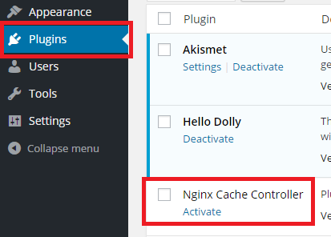

有効になると、左上にNginx Cacheメニューが出現します。

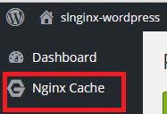

Settings for Flush Cacheのカテゴリで、Enable Flush Cache を Yesと選択します。

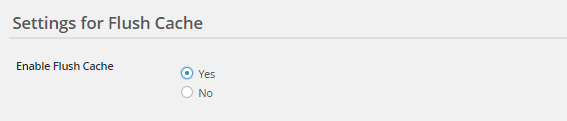

Cache Directoryを、前述で設定したproxy_cache_pathに変更します。

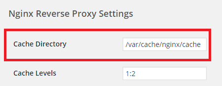

コンテンツ投稿時の振る舞いを確認します。記事が投稿された時にはキャッシュを全て、コメントが投稿された場合は該当のページのキャッシュのみを削除します。

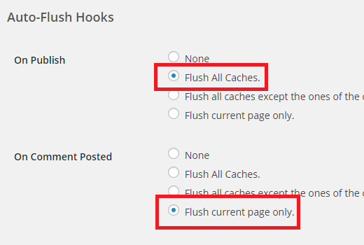

最後に、Save Changesをクリックし、キャッシュ制御の設定は完了です。

#### コンテンツキャッシュの同期設定
Nginx Cache Controllerはコンテンツ更新時にキャッシュを制御できますが、このプラグインはWordPressサーバとリバースプロキシが同一のサーバで動作する環境を想定しているため、本ハンズオンのようにリバースプロキシとWordPressサーバを分離している環境では適切に動作しません。そこで、lsyncdを用いてフロントエンドのリバースプロキシとバックエンドのWordPressサーバ間でキャッシュファイルを同期し、WordPressサーバがNginx Cache Controllerを用いてリバースプロキシのキャッシュファイルを削除できるようにします。

リバースプロキシ、WordPressサーバともにlsyncdのセットアップはProvisioning Script内で完了しています。通信に必要な鍵ファイルを適切に配置し、lsyncdの設定ファイルを用意して自動同期環境を構築しましょう。同期はNginxユーザーで行う必要があるため、権限を適切に設定する必要があります。自動で同期を行うために、作業用インスタンス上でパスワードを要求されない空の鍵ペアを作成し、ロードバランサーとWordPressノードの双方に配置します。

**[COMMAND]**

```
[root@workingvm ~]# ssh-keygen -f ~/.ssh/emptypass
Generating public/private rsa key pair.
Enter passphrase (empty for no passphrase): (何も入力せずEnter)
Enter same passphrase again: (何も入力せずEnter)
Your identification has been saved in /root/.ssh/emptypass.
Your public key has been saved in /root/.ssh/emptypass.pub.
The key fingerprint is:
cc:5e:59:21:44:99:42:e3:26:5e:73:41:bb:70:af:45 root@workingvm
The key's randomart image is:
+---[RSA 2048]----+
|       .o+*o.    |
|       ...o+ .   |
|      . *.+ E    |
|     . * = *     |
|      . S + o    |
|       . . o     |
|        . .      |
|                 |
|                 |
+-----------------+
[root@workingvm ~]# scp -r ~/.ssh root@[ロードバランサーのPublic IP Address]:/tmp
[root@workingvm ~]# scp -r ~/.ssh root@[WordPressサーバ1のPublic IP Address]:/tmp
[root@workingvm ~]# scp -r ~/.ssh root@[WordPressサーバ2のPublic IP Address]:/tmp
```

作成した鍵ペアを各サーバで適切に配置します。

**[COMMAND]**

```
[root@frontweb ~]# ssh root@[ロードバランサーのPublic IP Address]
[root@lb ~]# mv /tmp/.ssh/emptypass.pub /tmp/.ssh/authorized_keys
[root@lb ~]# cp -r /tmp/.ssh /var/cache/nginx
[root@lb ~]# chown -R nginx:nginx /var/cache/nginx/.ssh
```
同様の設定をWordPressサーバ1と2でも行ってください。

最後に、lsyncdの設定ファイルを編集し、同期を行います。ロードバランサーは配下のWordPressサーバ1と2の両方と動機する設定を、WordPressノードはロードバランサーノードとのみ同期する設定を行います。まずはロードバランサーノードの設定です。

**[COMMAND]**

```
[root@lb ~]# vi /etc/lsyncd.conf

settings {
    logfile = "/var/log/lsyncd/lsyncd.log",
    statusFile = "/var/log/lsyncd/lsyncd-status.log",
    statusInterval = 20
}

sync {
    default.rsync,
    delay = 0,
    source="/var/cache/nginx/cache",
    target="nginx@WordPressサーバ1のIPアドレス:/var/cache/nginx/cache/",
    rsync = {
        rsh = "/usr/bin/ssh -i /var/cache/nginx/.ssh/emptypass -o StrictHostKeyChecking=no"
    },
    delete = "running",
    init  = false
}

sync {
    default.rsync,
    delay = 0,
    source="/var/cache/nginx/cache",
    target="nginx@WordPressサーバ2のIPアドレス:/var/cache/nginx/cache/",
    rsync = {
        rsh = "/usr/bin/ssh -i /var/cache/nginx/.ssh/emptypass -o StrictHostKeyChecking=no"
    },
    delete = "running",
    init  = false,
}
[root@lb ~]# /etc/init.d/lsyncd start
```

WordPressノードに設定ファイルを追加し、同期するためのディレクトリを作成してください。

**以下の設定は、二台のWordPressサーバ両方で実行してください**

**[COMMAND]**

```
[root@wordpress1 ~]# mkdir /var/cache/nginx/cache
[root@wordpress1 ~]# chown –R nginx:nginx /var/cache/nginx/cache
[root@wordpress1 ~]# vi /etc/lsyncd.conf

settings {
    logfile = "/var/log/lsyncd/lsyncd.log",
    statusFile = "/var/log/lsyncd/lsyncd-status.log",
    statusInterval = 20
}

sync {
    default.rsync,
    delay = 0,
    source="/var/cache/nginx/cache",
    target="nginx@ロードバランサーのIPアドレス:/var/cache/nginx/cache/",
    rsync = {
        rsh = "/usr/bin/ssh -i /var/cache/nginx/.ssh/emptypass -o StrictHostKeyChecking=no"
    },

    delete = "running",
    init  = false
}

[root@wordpress1 ~]# /etc/init.d/lsyncd start
```

以上でキャッシュファイルを同期するlsyncdの設定が完了しました。各サーバでlsyncdを起動すると、キャッシュファイルが同期されるようになります。

## Zabbixサーバへの登録
各サーバ上ではProvisioning Scriptで導入されたZabbixエージェントが起動しています。Zabbix監視サーバにこれらの子サーバ群を登録し、一括で監視できるよう設定を施しましょう。上部メニューのConfiguration→Hostsの順にクリックしましょう。

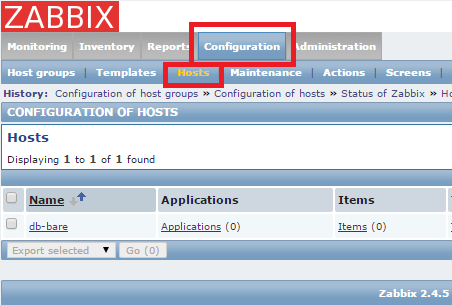

ノード一覧が表示されるので、右端のCreate hostを選択します。


設定画面が表示されるので、内容を登録します。Host Nameに各サーバのホスト名を、Visible NameにはZabbix上で表示される名前を指定します。Groupsでは、右にあるLinux servesをクリックして \<\< ボタンを押すことで選択できます。下のAgent InterfaceのIPアドレスには各ノードのSoftLayerのPrivate IP Addressを登録してください。入力が完了したら、最下段のAddをクリックすることで、ノードのZabbixへの登録が完了します。

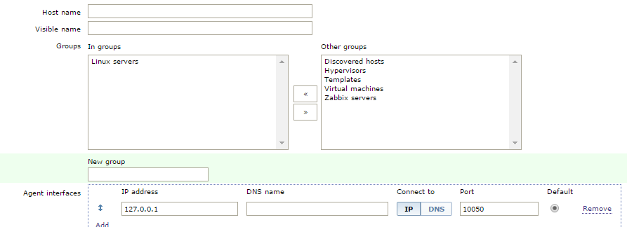

監視するノードを追加したら、次は監視する項目を追加します。今度は、Templatesタブをクリックします。テンプレート追加画面を開いたら、画面中央のSelectを選択し監視する内容を選択します。データベースサーバはTemplate Add MySQLに、システム全体の監視をする場合はTemplate OS Linuxにチェックを入れて最下段のSelectを押してください。ポップアップウインドウが閉じた後、下部のAddをクリックし、更に下部のUpdateをクリックしてください。

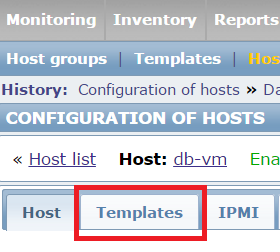

以上で、選択したTemplateの内容がZabbixに集積され、グラフ化されてモニタリングできます。Monitoring -> Graphs -> Groupで「Linux servers」を選択 -> Graphで確認したい項目を選択することで、収集した情報の推移を確認することができます。

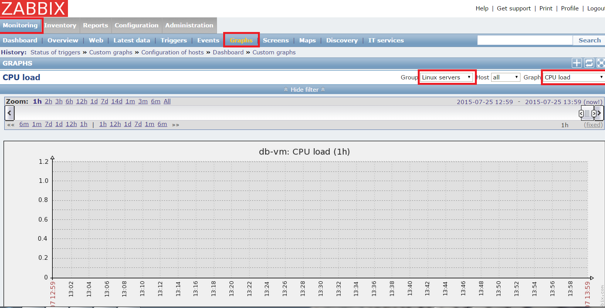

# 最後に
本ハンズオンで作成した、全ての仮想インスタンスとオブジェクトストレージを削除して終了してください。その他イメージなどを作成された方は、イメージなども削除してください。

（本ハンズオンで利用した環境を、ハンズオン終了後も利用される方は、残しておいても問題ありませんが、課金されることをご理解いただければと思います）

## 仮想インスタンスの削除
[Device] - [Device list] - 自分のサーバ - [Actions] - [Cancel Device]

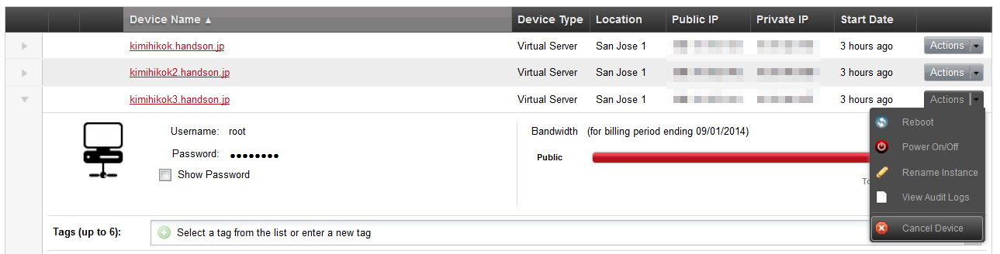

## Object Storage内のファイルの削除
管理ポータルからは、ファイルの一括操作を行うことができないので、Webサーバーから、下記のように自分のコンテナごと削除してください

（例: rm -rf /usr/share/wordpress/wp-content/uploads/student1031-sjc01-container）


